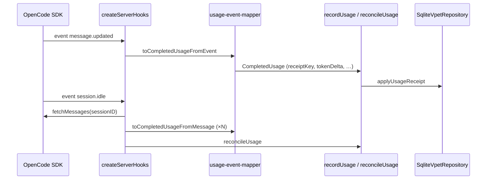
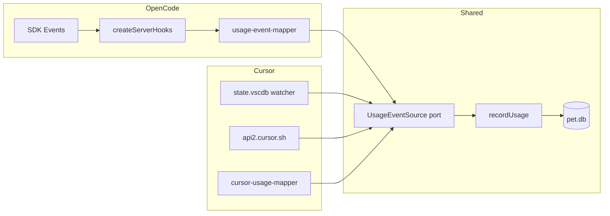
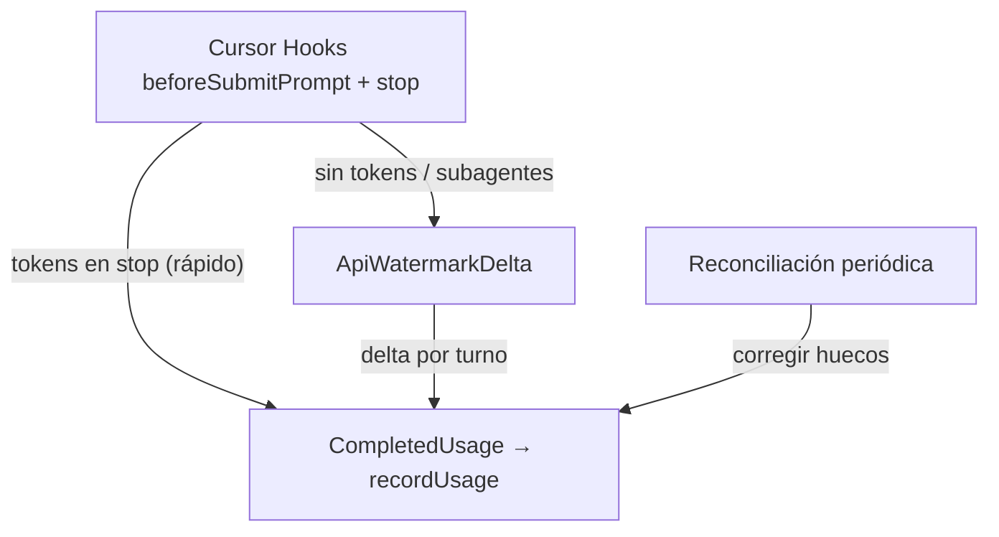
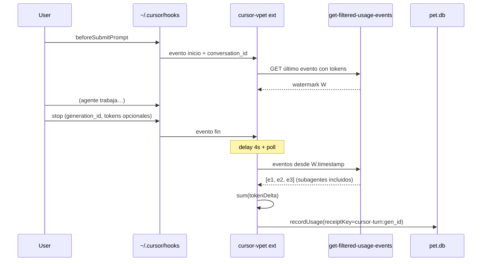
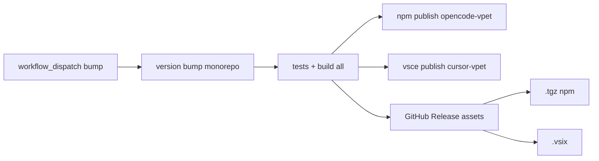

# Plan de implementación: opencode-vpet como extensión Cursor/VS Code

> Documento de planificación técnica — versión 1.0  
> Fecha: 2026-09-09  
> Alcance: extender opencode-vpet para publicar dos artefactos (npm + VSIX) desde un monorepo compartido.

---

## 1. Resumen ejecutivo

**opencode-vpet** es hoy un plugin dual de OpenCode (servidor + TUI) que evoluciona un Digimon virtual según el consumo de tokens de IA. La arquitectura hexagonal existente (~60–70 % reutilizable) permite extraer el núcleo de dominio y aplicación a un paquete compartido (`vpet-core`) y añadir un adaptador Cursor (`cursor-vpet`) sin duplicar lógica de evolución, persistencia ni view-models.

El **riesgo crítico** es la obtención de tokens en Cursor: **no existe API oficial de extensión para eventos por mensaje**. OpenCode expone `message.updated` y `session.idle` con tokens fiables; Cursor obliga a estrategias no documentadas (lectura de `state.vscdb`, endpoints internos de `api2.cursor.sh` / `cursor.com`) con alta fragilidad y cobertura incompleta.

**Recomendación:** adoptar un port `UsageEventSource` con estrategia en capas — (1) hooks Cursor `beforeSubmitPrompt` + `stop`, (2) **delta API watermark** al final de cada turno (snapshot al inicio, suma de eventos nuevos tras delay de 4–20 s), (3) reconciliación periódica — con idempotencia vía `receiptKey` ya presente en el dominio. Ver §5.12.

**Entregables:** monorepo con tres paquetes, extensión VS Code publicable en Marketplace (compatible con Cursor), CI dual en PR/push, CD con semver unificado (npm + VSIX + GitHub Release).

---

## 2. Estado actual del proyecto

### 2.1 Arquitectura

```
packages/
├── vpet-core/
│   ├── domain/           # Evolución, etapas, partner, nodos Digimon
│   ├── application/      # Casos de uso, ports, modelos
│   │   ├── ports/        # UsageLedger, PartnerLifecycle, VpetControl, …
│   │   └── use-cases/    # recordUsage, reconcileUsage, spawn, freeze, …
│   ├── adapters/sqlite/  # Schema, migraciones, write-store (SqliteExecutor)
│   ├── data/             # Catálogo Digimon, sprites, frames
│   ├── config/           # Settings globales
│   └── view-models/      # sidebar, dex, history (sin JSX de host)
├── opencode-vpet/
│   ├── src/adapters/opencode/  # Hooks servidor, mapeo de eventos, toasts
│   ├── src/adapters/sqlite/    # bun-sqlite-driver + factory delgada
│   ├── src/tui/                # OpenTUI + Solid: sidebar, dex, history
│   └── src/commands/           # /vpet-spawn, freeze, unfreeze, set
└── cursor-vpet/
    ├── src/adapters/cursor/    # UsageEventSource, auth, paths
    ├── src/adapters/sqlite/    # sql.js driver + factory delgada
    └── src/webview/            # UI embebida
```

**Patrón hexagonal:** `application/` no importa frameworks; `adapters/` implementan ports; tests `architecture-boundary` y `hexagonal-boundary` validan dirección de dependencias.

### 2.2 Flujo de tokens (OpenCode)



Referencias clave:

- `packages/opencode-vpet/src/adapters/opencode/create-server-hooks.ts` — suscripción a `message.updated` y `session.idle`
- `packages/opencode-vpet/src/adapters/opencode/usage-event-mapper.ts` — `tokenDelta` = input + output + reasoning + cache read/write
- `packages/vpet-core/src/application/use-cases/record-usage.ts` — idempotencia por `receiptKey`

### 2.3 Build y runtime

| Aspecto | Detalle |
|---------|---------|
| Package | `@sbugallo/opencode-vpet` (single package) |
| Build | `bun scripts/build.ts` — ESM, target `bun` (plugin) + `node` (CLI) |
| SQLite | `bun:sqlite` vía `SqliteExecutor` en `bun-sqlite-driver.ts` |
| UI | Solid + OpenTUI (`@opentui/solid`) — acoplada a OpenCode TUI |
| Tests | `bun test` — unitarios, persistencia, boundaries arquitectónicos |
| Datos | `~/Library/Application Support/opencode-vpet/pet.db` (macOS) |

### 2.4 CI/CD actual

**CI** (`.github/workflows/ci.yml`): en PR y push a `main` — format, lint, `bun run check`, tests, prepack, `npm pack --dry-run`.

**CD** (`.github/workflows/cd.yml`): `workflow_dispatch` manual — bump semver estable, tag, publish npm con provenance, GitHub Release con tarball.

No hay publicación VSIX ni jobs matriciales por paquete.

---

## 3. Arquitectura propuesta

### 3.1 Estructura monorepo

```
packages/
├── vpet-core/              # Dominio + aplicación + data + view-models + SQLite compartido
│   ├── domain/
│   ├── application/
│   ├── adapters/sqlite/    # schema, migraciones, write-store (SqliteExecutor)
│   ├── data/
│   ├── view-models/        # sidebar, dex, history (sin JSX de host)
│   └── package.json        # @sbugallo/vpet-core
├── opencode-vpet/            # Plugin OpenCode (server + tui)
│   ├── src/adapters/opencode/
│   ├── src/adapters/sqlite/  # bun-sqlite-driver + factory
│   ├── src/tui/              # OpenTUI wrappers
│   └── package.json          # @sbugallo/opencode-vpet (mismo nombre público)
└── cursor-vpet/              # Extensión VS Code / Cursor
    ├── src/
    │   ├── extension.ts
    │   ├── adapters/cursor/  # UsageEventSource, auth, paths
    │   ├── adapters/sqlite/  # node-sqlite-driver (sql.js)
    │   └── webview/          # UI Solid/HTML embebida
    ├── package.json          # cursor-vpet o @sbugallo/cursor-vpet
    └── .vscodeignore
```

**Workspace root:** `package.json` con `workspaces: ["packages/*"]`, scripts agregados (`bun run test --filter '*'`), Biome/TS config compartidos.

### 3.2 Dependencias entre paquetes

```mermaid
graph TD
    Core[vpet-core]
    OC[opencode-vpet]
    CV[cursor-vpet]

    OC --> Core
    CV --> Core

    OC --> BunSQLite[bun:sqlite]
    OC --> OpenTUI[OpenTUI / Solid]
    OC --> OpenCodeSDK[@opencode-ai/plugin]

    CV --> SqlJs[sql.js]
    CV --> VSCodeAPI[vscode]
    CV --> SolidWeb[Solid webview]
```

### 3.3 Principios de extracción

1. Mover `domain/`, `application/`, `data/` y view-models puros (`sidebar-view-model`, `dex-view-model`, `history-view-model`) a `vpet-core`.
2. Mantener `SqliteExecutor` como interfaz en `vpet-core` (o `vpet-core/ports`); drivers en cada adaptador host.
3. `CompletedUsage` y `UsageLedger` permanecen en core; cada host implementa su `UsageEventSource`.
4. Config: tipos compartidos en core; loaders específicos por host (`global-vpet-settings` OpenCode vs `vscode.workspace.getConfiguration`).

---

## 4. Mapa de equivalencias OpenCode ↔ Cursor

| Concepto | OpenCode | Cursor / VS Code |
|----------|----------|------------------|
| Punto de entrada plugin | `@opencode-ai/plugin` (`server` + `tui`) | `package.json` `activationEvents`, `extension.ts` |
| Eventos de uso IA | `message.updated`, `session.idle` (SDK oficial) | **No oficial** — SQLite `bubbleId:*`, APIs dashboard |
| Sesión / conversación | `sessionID`, `message.id` | `composerId`, `bubbleId` |
| Identificador estable mensaje | `message:${message.id}` | `bubble:${composerId}:${bubbleId}` o `usage-event:${timestamp}:${hash}` |
| Tokens por mensaje | `message.tokens.*` (fiable) | `tokenCount` en bubble JSON (~4 % poblado) o API agregada |
| Reconciliación al idle | `session.idle` + `fetchMessages` | Poll API / scan incremental DB al detectar fin de stream |
| Notificaciones | `client.tui.showToast` | `vscode.window.showInformationMessage` / webview toast |
| Sidebar UI | OpenTUI `sidebar-card.tsx` | `WebviewView` + HTML/Solid |
| Comandos | `/vpet-spawn`, etc. | `contributes.commands` + palette |
| Persistencia VPET | `opencode-vpet/pet.db` | Mismo path o `cursor-vpet/pet.db` (configurable; recomendar compartir si coexisten) |
| SQLite driver | `bun:sqlite` | `sql.js` (lectura `state.vscdb`) + `better-sqlite3` opcional solo para `pet.db` escribible |
| Config usuario | OpenCode settings JSON | `contributes.configuration` |
| Instalación | `npx @sbugallo/opencode-vpet init` | Marketplace / `.vsix` |
| API Cursor específica | N/A | `vscode.cursor.mcp.*`, `vscode.cursor.plugins.addPlugin` (MCP/plugins, **no usage**) |



---

## 5. Análisis detallado: obtención de tokens en Cursor

> **Esta sección es el área de mayor riesgo técnico y de producto.** Define la viabilidad del VPET en Cursor.

### 5.1 APIs oficiales de extensión Cursor

Según la [documentación de Extension API](https://cursor.com/docs/extension-api), el namespace `vscode.cursor` expone únicamente:

| API | Propósito |
|-----|-----------|
| `vscode.cursor.mcp.registerServer` / `unregisterServer` | Registrar servidores MCP |
| `vscode.cursor.plugins.addPlugin` / `removePlugin` | Registrar carpetas de plugin (`.cursor-plugin/plugin.json`) |

**No hay** métodos para: uso de tokens, eventos de chat, hooks de agente, ni métricas de billing.

> Nota: la documentación histórica mencionaba `registerPath`; en la práctica la API real es `addPlugin({ path })` apuntando al directorio raíz de un plugin individual, no a un directorio padre.

VS Code estándar ofrece `vscode.lm.*` y MCP server definitions, pero **no** expone consumo de tokens del proveedor Cursor.

**Conclusión:** cualquier tracking de tokens en extensión es **reverse-engineering**, no contrato estable.

### 5.2 Extensiones comunitarias (patrones observados)

| Proyecto | Enfoque | Granularidad | Notas |
|----------|---------|--------------|-------|
| [Sammy970/cursor-usage-extension](https://github.com/Sammy970/cursor-usage-extension) | Token JWT de `state.vscdb` → `GET api2.cursor.sh/auth/usage` | Cuota mensual por modelo (requests) | Enterprise-style buckets |
| [ClearMeasureLabs/cursor-usage-status](https://marketplace.visualstudio.com/items?itemName=ClearMeasureLabs.cursor-usage-status) | Connect RPC `GetCurrentPeriodUsage` + `/auth/usage` | Spend del periodo / requests restantes | Multi-endpoint según plan |
| [kovaren/cursor-usage-pace](https://github.com/kovaren/cursor-usage-pace) | `cursor.com/api/usage-summary` + SQLite local | Porcentajes Auto/API del ciclo | API no documentada |
| [NaumanMoazzam/cursor-limits](https://github.com/NaumanMoazzam/cursor-limits) | sql.js + APIs dashboard | Cuotas Fast/Premium | Sin dependencia de CLI sqlite3 |
| [lixwen/cursor-usage-monitor](https://github.com/lixwen/cursor-usage-monitor) | sql.js para token; polling API | Límites y alertas | Migró de sqlite3 CLI a sql.js |
| [Dwtexe/cursor-stats](https://github.com/Dwtexe/cursor-stats) | SQLite + APIs | Estadísticas de uso | Referenciado por la comunidad |
| [tokentopapp/agent-cursor](https://github.com/tokentopapp/agent-cursor) | Parser `composerData` + `bubbleId`, fs.watch | Por burbuja asistente | Estimación cuando `tokenCount` es 0 |
| [chat-grabber](https://www.npmjs.com/package/chat-grabber) | better-sqlite3 scan global DB | Export chat; tokens ~96 % cero | Documenta fragilidad de `tokenCount` |

**Patrón común:** leer `cursorAuth/accessToken` de `ItemTable` en `state.vscdb`, llamar APIs internas, mostrar en status bar. Ninguna replica fielmente el modelo event-driven de OpenCode.

### 5.3 Almacenamiento interno de Cursor

#### Ubicaciones

| Plataforma | Ruta `state.vscdb` |
|------------|-------------------|
| macOS | `~/Library/Application Support/Cursor/User/globalStorage/state.vscdb` |
| Windows | `%APPDATA%\Cursor\User\globalStorage\state.vscdb` |
| Linux | `~/.config/Cursor/User/globalStorage/state.vscdb` |

Archivos relacionados: `state.vscdb-wal`, `state.vscdb-shm` (modo WAL activo). La base puede crecer a **decenas de GB** en uso intensivo.

#### Esquema relevante

```sql
CREATE TABLE ItemTable (key TEXT UNIQUE ON CONFLICT REPLACE, value BLOB);
CREATE TABLE cursorDiskKV (key TEXT UNIQUE ON CONFLICT REPLACE, value BLOB);
```

#### Claves de autenticación (`ItemTable`)

| Key | Contenido |
|-----|-----------|
| `cursorAuth/accessToken` | JWT Bearer (corto plazo) |
| `cursorAuth/refreshToken` | Refresh OAuth |
| `cursorAuth/cachedEmail` | Email |
| `cursorAuth/stripeMembershipType` | Plan (`pro`, `ultra`, …) |

#### Claves de conversación (`cursorDiskKV`)

| Patrón | Contenido |
|--------|-----------|
| `composerData:{composerId}` | Metadatos sesión, `fullConversationHeadersOnly`, modelo, timestamps |
| `bubbleId:{composerId}:{bubbleId}` | Mensaje individual: `text`, `type`, `tokenCount`, `toolFormerData`, `modelInfo` |
| `checkpointId:{composerId}:{id}` | Snapshots de workspace |
| `messageRequestContext:{composerId}:{messageId}` | Contexto de prompt |
| `agentKv:*` | Mensajes/metadata adicionales (familia menos documentada) |

#### `tokenCount` en burbujas

Estructura observada (cuando está poblada):

```json
{
  "tokenCount": {
    "inputTokens": 41263,
    "outputTokens": 4901
  }
}
```

**Problemas documentados por la comunidad:**

- Cursor rellena `tokenCount` de forma **asíncrona** vía polling interno (`getTokenUsage`); en agent mode a menudo no hay `usageUuid` → queda en `{0,0}`.
- [chat-grabber](https://www.npmjs.com/package/chat-grabber) reporta **~96 %** de burbujas asistente con tokens cero.
- [agent-cursor](https://github.com/tokentopapp/agent-cursor) estima `text.length / 4` como fallback de output.

**Implicación para VPET:** la lectura local por burbuja es útil como señal temprana pero **insuficiente** como única fuente de verdad.

### 5.4 Endpoints HTTP internos

Base: `https://api2.cursor.sh` (Connect RPC v1, JSON).

Documentación reverse-engineered: [openusage-opencode/docs/providers/cursor.md](https://github.com/Noisemaker111/openusage-opencode/blob/main/docs/providers/cursor.md).

| Endpoint | Uso | Granularidad |
|----------|-----|--------------|
| `GET /auth/usage` | Cuota por modelo (`numRequests`, `maxRequestUsage`) | Agregado mensual |
| `POST /aiserver.v1.DashboardService/GetCurrentPeriodUsage` | Spend en centavos, % Auto/API | Periodo de facturación |
| `POST /aiserver.v1.DashboardService/GetPlanInfo` | Nombre plan, límite incluido | Metadatos |
| `cursor.com/api/usage-summary` | Resumen dashboard web | Agregado (no documentado) |
| `POST cursor.com/api/dashboard/get-filtered-usage-events` | Eventos paginados con `tokenUsage` | **Por llamada al modelo** (no por mensaje UI) |

Headers típicos: `Authorization: Bearer <accessToken>`, `Connect-Protocol-Version: 1`, `Content-Type: application/json`.

Refresh token: `POST /oauth/token` con `client_id` conocido (`KbZUR41cY7W6zRSdpSUJ7I7mLYBKOCmB`).

#### APIs Enterprise (oficiales, no aplicables a usuario individual)

- [Admin API](https://cursor.com/docs/account/teams/admin-api): `POST /teams/filtered-usage-events` con API key de equipo.
- [Analytics API](https://cursor.com/docs/account/teams/analytics-api): métricas agregadas por usuario, no eventos en tiempo real.

Incluyen `tokenUsage` fiable pero requieren rol admin y agregación horaria — **no viable** como fuente principal para VPET consumer.

#### Cambio de política de costes (julio 2026)

Cursor eliminó campos de coste por solicitud (`chargedCents`, `usageBasedCosts`, `totalCents`) en planes self-service del endpoint de usage events. Los **tokens** siguen disponibles; el coste en dólares ya no es fiable para extensiones que dependían de esos campos.

### 5.5 Enfoques evaluados

#### Opción A — Solo API agregada (`/auth/usage`, `GetCurrentPeriodUsage`)

| Pros | Contras |
|------|---------|
| Implementación simple | No hay eventos por mensaje → VPET no evoluciona por interacción |
| Datos alineados con dashboard | Solo sirve para UI de cuota, no para gameplay |
| Bajo riesgo de parseo SQLite | Requiere leer JWT de `state.vscdb` igualmente |

**Veredicto:** complemento útil (status bar de cuota), **insuficiente** para mecánica de evolución.

#### Opción B — Lectura incremental de `bubbleId:*` en `state.vscdb`

| Pros | Contras |
|------|---------|
| Latencia baja vía `fs.watch` + queries indexadas | `tokenCount` ausente o cero en >90 % casos |
| Alineado con modelo mental de “mensaje completado” | DB enorme; WAL isolation en lectores |
| No requiere red tras lectura local | Esquema JSON cambia sin aviso |
| Comunidad probó el patrón (agent-cursor, tracedecay) | Subagentes pueden no reflejarse en una burbuja |

**Veredicto:** **capa primaria** con deduplicación y reintentos hasta que `tokenCount` se pueble o timeout.

#### Opción C — Polling `get-filtered-usage-events`

| Pros | Contras |
|------|---------|
| Tokens por llamada al modelo (más fiable que bubble) | API no documentada; paginación; latencia minutos |
| Incluye cache read/write | No mapea 1:1 a burbuja UI; varios eventos por “turno” |
| Cookie/session alternativa: `WorkosCursorSessionToken` solo en browser | Requiere JWT local de todas formas para extensión |

**Veredicto:** **capa de reconciliación** periódica (cada 5–15 min) para corregir subconteos.

#### Opción D — FileSystemWatcher sin SQLite (solo detectar cambios)

| Pros | Contras |
|------|---------|
| Mínimo acoplamiento al esquema | Igualmente necesita abrir SQLite para leer valores |
| Eficiente para “dirty flag” | Falsos positivos en WAL; debounce necesario |

**Veredicto:** **mecanismo de señal**, no fuente de datos por sí solo.

#### Opción E — Hooks oficiales de agente Cursor (`afterAgentResponse`, SDK)

Según el foro de Cursor, hooks del SDK/agent reportan tokens del agente principal pero **no subagentes**; campos opcionales; no expuestos a extensiones VS Code estándar.

**Veredicto:** no aplicable al packaging VSIX objetivo.

#### Opción F — Admin API Enterprise

**Veredicto:** fuera de alcance para extensión pública; mencionar en docs para equipos que quieran integración custom.

### 5.6 sql.js vs better-sqlite3

| Criterio | sql.js | better-sqlite3 |
|----------|--------|----------------|
| Distribución en VSIX | WASM/JS puro, sin rebuild por Electron | Binario nativo — **NODE_MODULE_VERSION** debe coincidir con el host |
| Lectura `state.vscdb` grande | Carga archivo completo en memoria → riesgo OOM en DBs >2–5 GB | Lectura por archivo, queries indexadas eficientes |
| Modo WAL | No ve commits recientes del writer sin copiar WAL | Con conexión RW evita snapshot isolation (patrón agent-cursor) |
| Mantenimiento | Usado por cursor-limits, cursor-usage-monitor | Usado por chat-grabber; problemas reportados en Cursor agent worker (ABI 127 vs 137) |
| Recomendación VPET | **Lectura token + queries puntuales** (`key = ?`) | **Solo `pet.db` propio** si se necesita rendimiento de escritura (evaluar `sql.js` también para pet.db por simplicidad) |

**Estrategia recomendada:**

1. `state.vscdb`: sql.js con lectura de buffer + queries por clave; nunca `SELECT *` ni full scan.
2. Alternativa avanzada (fase 2): abrir URI `file:path?mode=ro&immutable=1` vía better-sqlite3 **solo si** se empaqueta prebuild para múltiples targets VS Code — alto coste de mantenimiento.
3. Evitar depender del binario `sqlite3` CLI (fragilidad Windows, sandbox).

### 5.7 Fragilidad y compatibilidad de versiones

| Riesgo | Probabilidad | Impacto |
|--------|--------------|---------|
| Cambio de esquema `bubbleId` JSON | Media | Parser falla; necesita actualización extensión |
| Renombre de keys `cursorAuth/*` | Baja | Auth rota; fallback a SecretStorage manual |
| Rotura endpoints Connect RPC | Media | Reconciliación API falla; modo degradado local |
| DB multi-GB | Alta en power users | OOM con sql.js; necesita path override y límites |
| Cursor vs VS Code puro | Media | Extensión funciona en VS Code pero sin `state.vscdb` de Cursor |
| Política Marketplace | Baja-Media | Lectura de tokens locales puede requerir disclosure claro |

**Mitigaciones:** feature flags por fuente, versión de parser (`cursorStorageSchemaVersion`), telemetría **opt-in** de errores de parseo (sin tokens), tests con fixtures SQLite anonimizados.

### 5.8 Privacidad y seguridad

| Tema | Directriz |
|------|-----------|
| Access token | Leer solo `cursorAuth/accessToken`; **nunca** persistir en logs ni `globalState` sin cifrar |
| Alternativa | `vscode.SecretStorage` para token manual si auto-detección falla |
| Destinos red | Solo `api2.cursor.sh` / `cursor.com` — documentar en README y `package.json` |
| Permisos extensión | Evitar `readFile` amplio; rutas limitadas a globalStorage Cursor |
| Datos chat | VPET no necesita almacenar `text` de burbujas — solo IDs y conteos |
| Cumplimiento Marketplace | Sección “Privacy” explícita; no enviar datos a terceros |

### 5.9 Recomendación concreta

Implementar **`CursorUsageEventSource`** con tres capas, en orden de prioridad:



| Capa | Rol | Latencia | Cubre subagentes |
|------|-----|----------|------------------|
| **Hooks `stop`** | Fuente primaria cuando hay tokens en el payload | ~0 s | No (solo agente padre) |
| **API watermark delta** | Fuente secundaria por turno; suma todas las llamadas al modelo | 4–15 s | Sí |
| **Reconciliación periódica** | Corrige huecos si hooks o delta fallan | 10–60 min | Sí |

La capa central es la **estrategia API watermark** (§5.12). Los hooks acortan la latencia y evitan polling cuando Cursor incluye tokens en `stop`; la API completa el turno cuando hay subagentes o tokens ausentes en el hook.

### 5.12 Estrategia API watermark (delta por turno)

> Propuesta validada: snapshot al inicio del turno, delta al final con delay para que Cursor persista los eventos.

#### Idea

Cada **turno de agente** (usuario envía prompt → agente termina) se trata como una ventana temporal sobre el listado de `get-filtered-usage-events`:

1. **Inicio de ejecución** (`beforeSubmitPrompt` o equivalente): consultar la API y guardar un **watermark** — la última fila con tokens válidos.
2. **Fin de ejecución** (`stop`): esperar un delay (4 s inicial), consultar el listado desde el watermark, **sumar tokens de todas las filas nuevas** y emitir un único `CompletedUsage` por turno.

Esto alinea la granularidad con OpenCode (un receipt por interacción completada) mientras captura **todas las llamadas al modelo** del turno (incluidos subagentes), que el hook `stop` no incluye.

#### Detección de inicio y fin

| Señal | Fuente | Fiabilidad |
|-------|--------|------------|
| Inicio | Hook `beforeSubmitPrompt` | Alta (oficial) |
| Fin | Hook `stop` con `status: completed` | Alta (oficial) |
| Fin (fallback) | Cambio en `composerData` / última burbuja asistente en `state.vscdb` | Media |
| Fin (fallback) | `FileSystemWatcher` en `state.vscdb-wal` tras periodo de inactividad | Baja |

**Recomendación:** la extensión instala un hook global en `~/.cursor/hooks.json` (comando bundled en el VSIX) que escribe eventos en un archivo bajo `globalStorageUri` (`vpet-hook-events.jsonl`). La extensión observa ese archivo con `FileSystemWatcher`. Esto evita parsear `state.vscdb` solo para detectar ciclo de vida.

El hook `stop` también puede incluir (no documentado aún en cursor.com/docs/hooks, pero presente en runtime):

```json
{
  "hook_event_name": "stop",
  "conversation_id": "a1b2c3d4-...",
  "generation_id": "f0e1d2c3-...",
  "input_tokens": 1180993,
  "output_tokens": 8146,
  "cache_read_tokens": 1007022,
  "cache_write_tokens": 173957
}
```

> `input_tokens` **incluye** cache read/write. Para alinear con OpenCode:  
> `tokenDelta = input_tokens + output_tokens` (no sumar cache por separado).

Si `stop` trae tokens y `vpet.usage.subagentTracking` es `false`, usar el hook directamente y **saltar** el delta API. Si es `true` (default), siempre ejecutar delta API al final del turno.

#### Algoritmo watermark

```typescript
type UsageWatermark = {
  readonly timestampMs: number      // timestamp del último evento visto
  readonly fingerprint: string      // hash estable del último evento (anti-colisión)
  readonly conversationId?: string
}

// Al inicio del turno (beforeSubmitPrompt)
async function captureWatermark(auth: CursorAuth): Promise<UsageWatermark> {
  const events = await fetchUsageEvents({ page: 1, pageSize: 1 }) // más reciente primero
  const latest = events.find(hasValidTokens)
  return {
    timestampMs: Number(latest?.timestamp ?? Date.now()),
    fingerprint: fingerprintEvent(latest),
    conversationId: prompt.conversation_id,
  }
}

// Al fin del turno (stop)
async function settleTurnDelta(
  watermark: UsageWatermark,
  generationId: string,
): Promise<CompletedUsage | null> {
  const newEvents = await pollNewEventsSince(watermark, {
    initialDelayMs: 4000,
    retries: [4000, 6000, 10000],  // hasta ~20 s total
    minNewEvents: 1,
  })

  if (newEvents.length === 0) return null

  const tokenDelta = sumTokenDelta(newEvents)
  return {
    receiptKey: `cursor-turn:${generationId}`,
    eventId: `cursor-api-delta:${generationId}`,
    tokenDelta,
    cost: null,
    createdAt: new Date().toISOString(),
  }
}
```

#### Consulta API al fin del turno

```http
POST https://cursor.com/api/dashboard/get-filtered-usage-events
Authorization: Bearer <cursorAuth/accessToken desde state.vscdb>
Origin: https://cursor.com
Content-Type: application/json

{
  "startDate": "<watermark.timestampMs>",
  "endDate": "<nowMs>",
  "page": 1,
  "pageSize": 100
}
```

Paginar mientras `page * pageSize < totalUsageEventsCount` y `hasNextPage` (Admin API) o hasta que no haya más filas.

**Filtrado client-side:**

```typescript
function isNewEvent(event: UsageEvent, watermark: UsageWatermark): boolean {
  const ts = Number(event.timestamp)
  if (ts < watermark.timestampMs) return false
  if (ts === watermark.timestampMs && fingerprintEvent(event) === watermark.fingerprint) return false
  return hasValidTokens(event)
}

function hasValidTokens(event: UsageEvent): boolean {
  if (!event.isTokenBasedCall || !event.tokenUsage) return false
  const { inputTokens, outputTokens, cacheWriteTokens = 0, cacheReadTokens = 0 } = event.tokenUsage
  return inputTokens + outputTokens + cacheWriteTokens + cacheReadTokens > 0
}

function sumTokenDelta(events: UsageEvent[]): number {
  return events.reduce((sum, e) => {
    const t = e.tokenUsage!
    return sum + t.inputTokens + t.outputTokens + (t.cacheWriteTokens ?? 0) + (t.cacheReadTokens ?? 0)
  }, 0)
}

function fingerprintEvent(event: UsageEvent | undefined): string {
  if (!event) return "none"
  const t = event.tokenUsage
  return `${event.timestamp}:${event.model}:${t?.inputTokens ?? 0}:${t?.outputTokens ?? 0}`
}
```

#### Delay y reintentos

| Intento | Espera acumulada | Motivo |
|---------|------------------|--------|
| 1 | 4 s | Tiempo mínimo para que Cursor persista eventos (propuesta inicial) |
| 2 | +6 s (10 s total) | Agregación horaria puede tardar varios segundos |
| 3 | +10 s (20 s total) | Turnos con muchas tool calls / subagentes |
| Timeout | — | Emitir con tokens del hook `stop` si existen; si no, encolar reconciliación |

No usar un único delay fijo: **poll hasta que aparezca ≥1 evento nuevo** o se agoten reintentos.

#### Idempotencia y anti-doble-conteo

| Riesgo | Mitigación |
|--------|------------|
| Mismo turno procesado dos veces | `receiptKey: cursor-turn:${generation_id}` (único por turno) |
| Evento en el límite del watermark | `fingerprint` del último evento + comparación `>` estricta en timestamp |
| Hook `stop` + delta API cuentan lo mismo | Si hook usado como primario, delta solo suma eventos **post-watermark**; el watermark se captura **antes** del turno |
| Turnos concurrentes en distintas conversaciones | Watermark **por `conversation_id`**, no global |
| Eventos sin ID estable | `fingerprint` = `timestamp:model:input:output`; dedup en `recordUsage` por `receiptKey` |

#### Flujo completo (secuencia)



#### Integración con hooks (instalación)

Al activar la extensión, registrar en `~/.cursor/hooks.json`:

```json
{
  "version": 1,
  "hooks": {
    "beforeSubmitPrompt": [{ "command": "node <ext-path>/dist/hook-bridge.js", "args": ["beforeSubmitPrompt"] }],
    "stop": [{ "command": "node <ext-path>/dist/hook-bridge.js", "args": ["stop"] }]
  }
}
```

`hook-bridge.js` lee JSON por stdin, append a `globalStorageUri/vpet/hook-events.jsonl`, responde `{}` por stdout (fail-open).

#### Configuración VS Code

```json
{
  "vpet.usage.settleDelayMs": 4000,
  "vpet.usage.settleMaxWaitMs": 20000,
  "vpet.usage.subagentTracking": true,
  "vpet.usage.preferHookTokens": false
}
```

- `subagentTracking: true` → siempre delta API al `stop` (recomendado para VPET).
- `preferHookTokens: true` → usar solo `stop` si trae tokens (más rápido, sin subagentes).

#### Limitaciones conocidas

| Limitación | Impacto | Mitigación |
|------------|---------|------------|
| API no documentada | Puede romperse | Contract tests + flag para desactivar capa API |
| Latencia 4–20 s por turno | XP no es instantáneo | Toast/notificación al aplicar; animación sidebar en pending |
| Cmd+K inline sin hooks Agent | Turnos Tab no disparan `stop` | Excluir o tratar Tab por separado (`beforeTabFileRead` no aporta tokens) |
| Cloud agents sin hooks de usuario | Sin watermark local | Reconciliación periódica solo |
| `input_tokens` del hook incluye cache | Conteo inflado vs OpenCode | Usar misma fórmula en ambos lados; documentar |

### 5.9 (legacy) Capas auxiliares

1. **Reconciliación periódica:** cada 10–60 min, `get-filtered-usage-events` desde último `receiptKey` API conocido; emite eventos huérfanos con `receiptKey: usage-event:${fingerprint}`.
2. **Parser de burbujas (opcional):** solo si hooks no están instalados; ver §5.5 opción B. Menor prioridad que watermark API.
3. **Delta vs absoluto:** nunca diferenciar cuotas agregadas (`/auth/usage`); solo deltas por evento o por turno.

### 5.10 Diseño del port `UsageEventSource`

```typescript
// packages/vpet-core/src/application/ports/usage-event-source.ts

export type UsageObservation = {
  readonly receiptKey: string
  readonly eventId: string
  readonly tokenDelta: number
  readonly cost?: number | null
  readonly createdAt: string
  readonly source: "bubble" | "api" | "estimate"
  readonly confidence: "high" | "medium" | "low"
}

export type UsageEventSource = {
  /** Suscribe callbacks; retorna dispose */
  subscribe(handler: (usage: UsageObservation) => void): { dispose(): void }
  /** Fuerza reconciliación (comando manual / al activar extensión) */
  reconcile(): Promise<void>
}
```

Adaptadores:

| Paquete | Implementación |
|---------|----------------|
| `opencode-vpet` | `OpenCodeUsageEventSource` — envuelve hooks existentes |
| `cursor-vpet` | `CursorUsageEventSource` — hooks + API watermark delta + reconciliación |

El caso de uso `recordUsage` acepta `CompletedUsage` (subset sin `source`/`confidence`); el adaptador Cursor puede filtrar observaciones `confidence: "low"` según setting `vpet.acceptEstimatedTokens`.

### 5.11 Estrategia de tests

| Nivel | Qué probar |
|-------|------------|
| Unit | Parsers JSON de bubble con fixtures grabados (versiones Cursor N, N-1) |
| Unit | Mapeo `tokenCount` → `tokenDelta` alineado con OpenCode (incl. cache) |
| Unit | Generación `receiptKey` estable |
| Integration | DB SQLite sintética en tmp con `ItemTable` + `cursorDiskKV` |
| Integration | Mock HTTP Connect RPC con respuestas grabadas |
| Contract | Golden files de `get-filtered-usage-events` (actualizar en CI weekly cron opcional) |
| E2E manual | Matriz: Pro, Ultra, Agent mode, Composer, subagente |
| Regression | Cuando Cursor actualiza, issue template para adjuntar bubble anonimizado |

Fixtures: repositorio `packages/cursor-vpet/fixtures/state-vscdb-samples/` con bases mínimas (<1 MB), nunca tokens reales.

---

## 6. Persistencia

### 6.1 Abstracción `SqliteExecutor`

Mantener la interfaz actual (`run`, `get`, `all`, `transaction`) en `vpet-core`. Implementaciones:

| Driver | Host | Archivo |
|--------|------|---------|
| `createBunSqliteExecutor` | OpenCode | `packages/opencode-vpet/src/adapters/sqlite/bun-sqlite-driver.ts` |
| `createNodeSqliteExecutor` | Cursor | `packages/cursor-vpet/adapters/sqlite/node-sqlite-driver.ts` |

**Cursor `pet.db`:** sql.js con persistencia write-via-export (exportar buffer tras transacciones) en `packages/cursor-vpet/src/adapters/sqlite/`.

### 6.2 Rutas de datos

| Archivo | Propósito | Ruta propuesta |
|---------|-----------|----------------|
| `pet.db` | Estado VPET (partner, gauge, receipts) | `{appData}/opencode-vpet/pet.db` (mantener compatibilidad) o `{appData}/cursor-vpet/pet.db` |
| `state.vscdb` | Solo lectura Cursor | Auto-detect + setting `cursorVpet.stateDbPath` |

`resolveHostDatabasePath` se generaliza en core con parámetro `appDirectoryName`.

### 6.3 Compartir progreso OpenCode + Cursor

Si un usuario usa ambos hosts, opciones:

1. **Misma ruta por defecto** (`opencode-vpet/pet.db`) — experiencia unificada.
2. Setting explícito `vpet.databasePath` en ambos hosts.

Recomendación: **opción 1** documentada; tests de path resolution cross-platform.

### 6.4 Migraciones

Reutilizar `sqlite-migrations.ts` sin cambios de esquema inicial. El ledger de receipts absorbe nuevas fuentes sin migración.

---

## 7. UI en Cursor

### 7.1 Contenedor: `WebviewView`

Registrar en `package.json`:

```json
{
  "contributes": {
    "views": {
      "explorer": [
        {
          "id": "cursorVpet.sidebar",
          "name": "VPet",
          "type": "webview"
        }
      ]
    }
  }
}
```

### 7.2 Reutilización de view-models

| Componente OpenCode | En Cursor |
|--------------------|-----------|
| `buildSidebarCardModel` | Webview recibe JSON del modelo; renderiza HTML |
| `dex-view-model` | Panel modal vía `createWebviewPanel` |
| `history-view-model` | Misma API de datos, distinto shell |
| Sprites / `monster-frame-catalog` | Copiar assets a `media/`; servir vía `webview.asWebviewUri` |

### 7.3 Stack UI recomendado

- **Fase 1:** HTML + CSS vanilla + imágenes pixel art (menor bundle).
- **Fase 2:** SolidJS embebido en webview (misma librería que TUI) si la complejidad de animación lo justifica.

Animaciones: portar lógica de `monster-animation.ts` (máquina de estados pura en core); rendering en canvas o CSS steps.

### 7.4 Comandos y UX

| Comando OpenCode | Comando VS Code |
|------------------|-----------------|
| `/vpet-spawn` | `Cursor VPet: Spawn Partner` |
| `/vpet-freeze` | `Cursor VPet: Freeze` |
| `/vpet-unfreeze` | `Cursor VPet: Unfreeze` |
| `/vpet-set` | Input box para Digimon ID |
| `/vpet-dex` | Abrir Dex webview |
| `/vpet-history` | Abrir History webview |

Toasts de evolución: `showInformationMessage` con botón “View” → foco en sidebar.

### 7.5 Polling de sidebar

OpenCode usa `sidebar-poll-loop.ts`. En Cursor: push desde extensión al webview tras cada `recordUsage` + poll ligero cada 30 s como fallback.

---

## 8. CI/CD dual

### 8.1 CI (PR y push a `main`)

```yaml
jobs:
  vpet-core:
    steps: [checkout, setup bun, install, test --filter vpet-core]
  opencode-vpet:
    needs: vpet-core
    steps: [..., bun run check, bun test, npm pack --dry-run]
  cursor-vpet:
    needs: vpet-core
    steps:
      - npm install -g @vscode/vsce
      - bun run build --filter cursor-vpet
      - xvfb-run vsce package --no-dependencies  # headless
      - bun test --filter cursor-vpet
```

Matriz opcional: `ubuntu-latest`, `macos-latest`, `windows-latest` solo para `cursor-vpet` (paths SQLite).

### 8.2 CD (release unificado)

Flujo propuesto (extender `cd.yml` o workflow paralelo):



| Artefacto | Target | Secreto |
|-----------|--------|---------|
| npm | `registry.npmjs.org` | `NPM_TOKEN` (OIDC provenance ya configurado) |
| VSIX | VS Code Marketplace | `VSCE_PAT` (Azure DevOps PAT con Marketplace publish) |
| Open VSX (opcional) | open-vsx.org | `OVSX_PAT` |

**Semver:** una versión en root o changelogs sincronizados; `opencode-vpet` y `cursor-vpet` comparten número (ej. `0.3.0`).

### 8.3 Pre-release / canales

- npm: tag `next` para `0.x-dev.0` (ya usado).
- VSIX: `vsce publish --pre-release` con `cursor-vpet@0.3.0-dev.0`.

### 8.4 Quality gates antes de publish

1. `bun run check` en todos los paquetes.
2. Tests persistencia SQLite.
3. `vsce ls` sin secretos.
4. Escaneo `state.vscdb` paths hardcodeados — solo en runtime resolve.

---

## 9. Plan de implementación por fases

| Fase | Entregable | Estimación |
|------|------------|------------|
| **0 — Spike tokens** | Prototipo `CursorHybridUsageEventSource` fuera de monorepo; matriz de cobertura tokenCount; decisión sql.js write | 3–5 días |
| **1 — Monorepo** | Extraer `vpet-core`, migrar `opencode-vpet`, CI verde, npm sin cambios de comportamiento | 4–6 días |
| **2 — Extension shell** | `cursor-vpet` activación, comandos, `pet.db` con sql.js, sidebar estático | 5–7 días |
| **3 — Usage pipeline** | Port `UsageEventSource`, watcher, parser bubbles, integración `recordUsage` | 7–10 días |
| **4 — API reconcile** | Cliente Connect RPC, polling, deduplicación cross-source | 4–5 días |
| **5 — UI completa** | Webview animado, dex, history, settings | 7–10 días |
| **6 — Hardening** | Fixtures, docs privacidad, degradación graceful, matrices OS | 4–6 días |
| **7 — CD dual** | vsce publish, Release con VSIX, documentación usuario | 2–3 días |

**Total estimado:** 36–52 días-persona (1 dev ≈ 7–10 semanas).

### Hitos de aceptación

- [ ] Misma evolución de partner con tokens reales en Agent mode (>80 % de turnos con delta > 0).
- [ ] Sin doble conteo entre bubble y API (receipts únicos).
- [ ] OpenCode sin regresiones; tests boundary verdes.
- [ ] VSIX instalable en Cursor 1.x y VS Code 1.9x.
- [ ] README bilingüe (es/en) con limitaciones de tokens.

---

## 10. Qué NO hacer

1. **No** depender solo de cuota agregada (`/auth/usage`) para evolución del pet.
2. **No** escanear completa `cursorDiskKV` ni cargar `state.vscdb` entero en memoria sin límite.
3. **No** empaquetar `better-sqlite3` para leer `state.vscdb` sin matriz de prebuilds Electron.
4. **No** almacenar refresh tokens ni access tokens en `globalState` sin cifrar.
5. **No** enviar contenido de chat a servidores externos.
6. **No** asumir paridad 1:1 OpenCode ↔ Cursor en tiempo real — comunicar latencia y estimaciones al usuario.
7. **No** duplicar lógica de evolución en el adaptador Cursor.
8. **No** usar APIs Enterprise como requisito para usuarios individuales.
9. **No** bloquear publicación en VS Code “puro” — degradar con mensaje “requiere Cursor” solo para fuentes de tokens.
10. **No** romper el paquete npm existente durante la migración a monorepo (mantener nombre y exports).

---

## 11. Riesgos y mitigaciones

| ID | Riesgo | Severidad | Mitigación |
|----|--------|-----------|------------|
| R1 | `tokenCount` vacío en mayoría de mensajes | **Alta** | Reintentos, API reconcile, setting estimación opt-in |
| R2 | Cambio de esquema SQLite/JSON por Cursor | **Alta** | Parser versionado, tests fixtures, release rápido |
| R3 | DB `state.vscdb` >5 GB → OOM con sql.js | **Media** | Queries por clave; setting path; documentar límites |
| R4 | Endpoints dashboard rotos | **Media** | Modo offline local; mensaje UI; feature flag API |
| R5 | Rechazo o flags Marketplace por lectura de auth | **Media** | Disclosure transparente; SecretStorage alternativo |
| R6 | Divergencia progreso OpenCode/Cursor | **Baja** | Misma `pet.db` por defecto |
| R7 | Complejidad monorepo | **Media** | Fase 1 dedicada; tooling Bun workspaces |
| R8 | Animación webview inferior a TUI | **Baja** | MVP estático; iterar en fase 5 |
| R9 | Usuario en VS Code sin Cursor | **Baja** | Extensión instalable pero usage deshabilitado |
| R10 | Subagentes no reflejados en bubbles | **Media** | API reconcile agrega tokens por `conversationId` cuando exista en eventos |

---

## Apéndice A — Referencias

- [Cursor Extension API](https://cursor.com/docs/extension-api)
- [Cursor Admin API](https://cursor.com/docs/account/teams/admin-api)
- [openusage-opencode — provider Cursor](https://github.com/Noisemaker111/openusage-opencode/blob/main/docs/providers/cursor.md)
- [cursaves — how Cursor stores chats](https://github.com/Callum-Ward/cursaves/blob/main/docs/how-cursor-stores-chats.md)
- [cursor-usage-pace README](https://github.com/kovaren/cursor-usage-pace)
- [vibe-replay — Cursor local storage](https://vibe-replay.com/blog/cursor-local-storage/)
- Código actual: `packages/opencode-vpet/src/adapters/opencode/create-server-hooks.ts`, `packages/opencode-vpet/src/adapters/sqlite/bun-sqlite-driver.ts`, `packages/vpet-core/src/view-models/sidebar-view-model.ts`

---

## Apéndice B — Ejemplo de mapeo bubble → CompletedUsage

```typescript
const toCompletedUsageFromBubble = (
  composerId: string,
  bubbleId: string,
  bubble: CursorBubbleJson,
): CompletedUsage | null => {
  if (bubble.type !== 2) return null // solo asistente
  const tokens = bubble.tokenCount
  if (!tokens) return null

  const tokenDelta =
    (tokens.inputTokens ?? 0) +
    (tokens.outputTokens ?? 0) +
    (tokens.cacheReadTokens ?? 0) +
    (tokens.cacheWriteTokens ?? 0)

  if (tokenDelta <= 0) return null

  return {
    receiptKey: `bubble:${composerId}:${bubbleId}`,
    eventId: `cursor-bubble:${composerId}:${bubbleId}`,
    tokenDelta,
    cost: null,
    createdAt: bubble.createdAt ?? new Date().toISOString(),
  }
}
```

---

*Fin del documento.*
