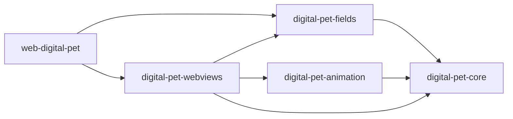

# Monorepo

The root workspace is private and coordinates seven packages:

| Package | Purpose |
| --- | --- |
| `packages/digital-pet-core` | Shared catalog, evolution rules, and SQLite schema |
| `packages/digital-pet-fields` | Reusable Fields, regions, locations, habitat rosters, and scenery assets |
| `packages/digital-pet-webviews` | Shared panels and browser presentation |
| `packages/web-digital-pet` | Web PWA, save selection, browser persistence, and device transfer |
| `packages/digital-pet-animation` | Shared animation and artwork logic |
| `packages/opencode-digital-pet` | OpenCode plugin published on npm |
| `packages/cursor-digital-pet` | Cursor extension published on Open VSX |

Cursor and OpenCode use the same local `pet.db` by default. The shared packages are bundled into the products and are not published separately.

## Region architecture

Dependencies flow from the host toward reusable packages:



Fields are species families; regions are destinations and can have multiple locations. The ten initial correspondences follow the game's selected mapping. Dragon Eye Lake is a second location under Digital Ocean. Habitat rosters are curated and can overlap.

`digital-pet-fields` owns definitions, queries, validation, scenery assets, and the visit persistence port. `digital-pet-webviews/panels/world` owns the public habitat guide and LCD panel presentation. The web host owns the overlay controller, asset delivery, and storage adapter: browser visits live in the transferable IndexedDB save, while computer visits are a separate web preference. SQLite is read only. Cursor keeps its existing partner view; no region scene or frame is injected there.

Exploring does not register species or change progression. The four additional Fields remain comments until supported. See [Digital Pet Fields](../packages/digital-pet-fields/README.md) for the asset filenames and catalog extension points.

## Development

Use Node `24.11.0`, npm `11.6.1`, and Bun `1.3.5`. From the repository root:

```sh
npm ci
npm run check
npm run test
npm run test:persistence
npm run build
```

To create local distributables:

```sh
npm run pack:opencode
npm run package --workspace cursor-digital-pet
```

The two products have independent versions and changelogs:

| Product | Changelog |
| --- | --- |
| OpenCode | [`packages/opencode-digital-pet/CHANGELOG.md`](../packages/opencode-digital-pet/CHANGELOG.md) |
| Cursor | [`packages/cursor-digital-pet/CHANGELOG.md`](../packages/cursor-digital-pet/CHANGELOG.md) |

Merging a pull request into `main` starts [the automatic release workflow](../.github/workflows/release-after-merge.yml). It publishes only products changed by the pull request; changes to core or animation publish both. The merge that adds this workflow does not run it. The next merge does, and that first automatic release publishes both products. Closing a pull request without merging it does not publish anything.

By default, a `feat:` pull request makes a minor release and other changes make a patch release. Add exactly one `release:major`, `release:minor`, or `release:patch` label to choose a different bump. The first OpenCode release follows its existing `0.2.0-dev.0` candidate and becomes `0.2.0`.

The release workflows update each product's package version and changelog, create its tag and GitHub Release, and publish OpenCode to npm or Cursor to Open VSX. Both product workflows start together. When one push moves `main`, the other rebases its release commits and retries. After publishing `0.2.0`, `main` moves to `0.2.1-dev.0`; the stable `0.2.0` metadata remains on the release tag. The individual workflows also allow a manual run. A failed publication can be re-run from its release tag without creating another version.

## Development tools

The development commands in each host preview feeding, activity, and evolution animations without waiting for live agent usage.

For Cursor, run the extension in an Extension Development Host or enable the `digital-pet.devTools` setting. The command palette then offers **Cursor Digital Pet: Dev Tools**.

For OpenCode, set `OPENCODE_DIGITAL_PET_DEV=1` before starting OpenCode. Its development commands appear under **Digital Pet Dev**.
