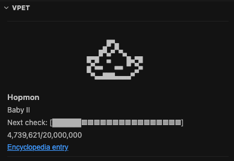
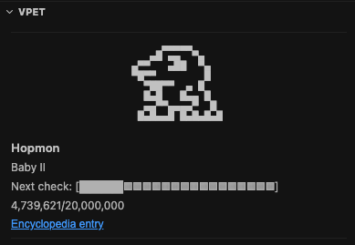
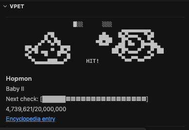

<div align="center" style="text-align: center;">
<center>
  <p align="center" style="text-align: center;"></p>
  <h1 align="center" style="text-align: center;">Cursor Digital Pet</h1>
  <p align="center" style="text-align: center;"><strong>Digimon virtual pet for Cursor that evolves as you use Agent — shares progress with OpenCode Digital Pet</strong></p>
  <p align="center" style="text-align: center;">
    <a href="https://open-vsx.org/extension/jcendal/cursor-digital-pet"></a>
    <a href="https://open-vsx.org/extension/jcendal/cursor-digital-pet"></a>
    <a href="https://open-vsx.org/extension/jcendal/cursor-digital-pet"></a>
    <a href="LICENSE"></a>
  </p>
  <p align="center" style="text-align: center;">
    <a href="#-features">Features</a> • <a href="#-installation">Installation</a> • <a href="#-usage">Usage</a> •
    <a href="#-commands">Commands</a> • <a href="#%EF%B8%8F-settings">Settings</a> • <a href="#-storage">Storage</a> •
    <a href="#-how-it-works">How It Works</a> • <a href="#-authors">Authors</a>
  </p>
  <p align="center" style="text-align: center;">
    <a href="https://open-vsx.org/extension/jcendal/cursor-digital-pet"></a>
    &nbsp;&nbsp;
    <a href="https://github.com/jcendal/digital-pet/releases"></a>
  </p>
</center>
</div>

---

<div align="center" style="text-align: center; white-space: nowrap;">
<center>



</center>
</div>

---

## 📖 About

**Cursor Agent** turns every prompt into real work — but what if that effort also fed a partner
that grows with you? **Cursor Digital Pet** adds a Digimon virtual pet to the Explorer sidebar. Your
partner gains experience from Agent token usage and evolves through classic Digimon stages.

It shares the same `pet.db` database as
[@jcendal/opencode-digital-pet](https://www.npmjs.com/package/@jcendal/opencode-digital-pet), so progress
carries over between Cursor and OpenCode.

### 🎯 Key Highlights

- 🐣 **Evolves with Agent usage** — Input, output, and cache tokens from Agent turns count
- 🔄 **Shared with OpenCode** — Same `pet.db`, Dex, and generation history across tools
- 🎮 **650 Digimon** — Evolution lines extracted from the original V-Pets
- 📊 **Sidebar + panels** — Live partner view, Dex browser, and generation history
- 🪝 **Reliable tracking** — Cursor hooks with API watermark fallback
- 🔒 **Privacy-first** — Local SQLite storage, no telemetry
- ⏸️ **Freeze anytime** — Pause progression without losing your partner

---

## ✨ Features

| Feature | Description |
| --- | --- |
| **Sidebar webview** | Animated ASCII partner artwork with stage gauge and evolution progress |
| **Dex panel** | Browse discovered Digimon from your collection |
| **History panel** | Review current and retired partner generations |
| **Token tracking** | Cursor hooks (`beforeSubmitPrompt` + `stop`) with API watermark fallback |
| **Shared database** | Compatible `pet.db` with the OpenCode Digital Pet plugin |
| **Partner commands** | Spawn, freeze, unfreeze, and set Digimon by catalog ID |
| **Hook management** | Install or uninstall hooks from the Command Palette |

---

## 📦 Installation

### Open VSX (Cursor)

Open Quick Open (`Ctrl+P` / `Cmd+P`) and run:

```
ext install jcendal.cursor-digital-pet
```

Or search for **Cursor Digital Pet** in the Extensions sidebar, or install from
[Open VSX](https://open-vsx.org/extension/jcendal/cursor-digital-pet).

### VSIX (manual)

Download the `.vsix` from
[GitHub Releases](https://github.com/jcendal/digital-pet/releases) and run
**Extensions → Install from VSIX…**.

---

## 🚀 Usage

### First run — install hooks

On first activation, the extension prompts you to register hooks in `~/.cursor/hooks.json`.
Hooks are required for reliable Agent token tracking.

You can also run **Cursor Digital Pet: Install Hooks** from the Command Palette at any time.

### Sidebar

Open the **Digital Pet** view in the Explorer sidebar to see your active partner, evolution gauge,
and animated artwork.

### Hatch a partner

1. Open the Command Palette (`Cmd+Shift+P` / `Ctrl+Shift+P`)
2. Run **Cursor Digital Pet: Spawn Partner**

Your partner starts as an egg and evolves as you complete Agent turns.

### Evolution battles

Evolution sequences can show your partner in a battle scene inside the sidebar.

### Other access methods

- **Command Palette** — all `Cursor Digital Pet:` commands
- **Explorer sidebar** — **Digital Pet** webview panel

---

## 🎮 Commands

| Command | Description |
| --- | --- |
| **Cursor Digital Pet: Spawn Partner** | Hatches a new egg |
| **Cursor Digital Pet: Freeze** | Pauses partner progression |
| **Cursor Digital Pet: Unfreeze** | Resumes partner progression |
| **Cursor Digital Pet: Set Digimon** | Overrides the partner with a catalog ID (e.g. `3-001`) |
| **Cursor Digital Pet: Open Dex** | Opens the partner Dex panel |
| **Cursor Digital Pet: Open History** | Opens the generation history panel |
| **Cursor Digital Pet: Install Hooks** | Registers hooks in `~/.cursor/hooks.json` |
| **Cursor Digital Pet: Uninstall Hooks** | Removes Digital Pet hooks from `~/.cursor/hooks.json` |

> **Note:** Using **Set Digimon** does not count toward Dex completion.

---

## 📝 Examples

### Shared database with OpenCode

By default, Cursor Digital Pet and OpenCode Digital Pet resolve the same `pet.db` path.
If you override the path in Cursor, point it to the database used by OpenCode:

```json
{
  "digital-pet.databasePath": "/path/to/opencode-digital-pet/pet.db"
}
```

### Slower API watermark fallback

If token deltas are not captured immediately after Agent turns, increase the settle delay:

```json
{
  "digital-pet.usage.settleDelayMs": 8000
}
```

---

## ⚙️ Settings

Configure via **File → Preferences → Settings** and search for `digital-pet`.

| Setting | Default | Description |
| --- | --- | --- |
| `databasePath` | _(empty)_ | Override path to `pet.db` (default: shared opencode-digital-pet location) |
| `usage.settleDelayMs` | `4000` | Initial delay before API watermark fallback (ms) |

> Changing `databasePath` requires reloading the Cursor window.

Stage labels and evolution thresholds use the built-in defaults from `@jcendal/digital-pet-core`
(Japanese naming by default). The OpenCode plugin can override these via
[`opencode-digital-pet.json`](https://github.com/jcendal/digital-pet/blob/main/packages/opencode-digital-pet/README.md#settings); Cursor Digital Pet does
not read that file yet.

---

## 🔧 Requirements

| Requirement | Details |
| --- | --- |
| **Cursor** | Token tracking requires Cursor (`state.vscdb` must be present) |
| **Extension host** | Node.js 22.13 or newer for native SQLite access to the shared `pet.db` |
| **Node.js** | Required on the system path to run `hook-bridge.js` from Cursor hooks |
| **Hooks** | `beforeSubmitPrompt` and `stop` entries in `~/.cursor/hooks.json` |

The extension shows a warning if it cannot detect the Cursor runtime. VS Code alone is not
enough for token tracking, though the sidebar and panels still work with an existing `pet.db`.

---

## 💾 Storage

Partner state, Dex discoveries, and generation history are stored in a SQLite database named
`pet.db`. By default it uses the same location as OpenCode Digital Pet:

| Platform | Default path |
| --- | --- |
| **macOS** | `~/Library/Application Support/opencode-digital-pet/pet.db` |
| **Linux / WSL** | `~/.local/share/opencode-digital-pet/pet.db` |
| **Windows** | `%APPDATA%\opencode-digital-pet\pet.db` |

Override with `digital-pet.databasePath` to use a custom file.
If the new database does not exist but an older `opencode-vpet/pet.db` does, the
extension continues using the older file, as does the OpenCode plugin.

---

## 🏗️ How It Works

```text
Cursor hooks → hook-bridge.js → digital-pet-hook-events.jsonl
                                      ↓
                         extension usage pipeline → pet.db
                                                       ↓
                                            Sidebar · Dex · History
```

1. Cursor hooks fire on `beforeSubmitPrompt` and `stop` for each Agent turn
2. `hook-bridge.js` appends structured events to `~/.cursor/digital-pet-hook-events.jsonl`
3. The extension watches the event log and maps stop payloads to completed usage
4. If stop tokens are missing, it falls back to Cursor's usage API (watermark delta)
5. Usage is applied through `@jcendal/digital-pet-core` evolution logic into `pet.db`
6. The sidebar webview refreshes with updated partner state and artwork

---

## 🔒 Privacy

- ✅ No extension telemetry or analytics
- ✅ Partner data stays in your local `pet.db`
- ✅ Hook events are written only to `~/.cursor/digital-pet-hook-events.jsonl`
- ⚠️ API watermark fallback reads your Cursor access token from local `state.vscdb` and
  queries `cursor.com/api/dashboard/get-filtered-usage-events` to compute token deltas
- ⚠️ When stop hooks include token counts, no network request is needed for that turn

---

## 🐛 Known Issues

| Issue | Workaround |
| --- | --- |
| Tokens not recorded after Agent turns | Run **Cursor Digital Pet: Install Hooks** and retry |
| Missing token data in stop hook | Increase `digital-pet.usage.settleDelayMs` (e.g. `8000`) |
| Running in VS Code instead of Cursor | Token tracking is unavailable; use Cursor for Agent usage |
| Database path change not applied | Reload the Cursor window after changing settings |

---

## 🤝 Contributing

Contributions, issues, and feature requests are welcome in the monorepo!

1. Fork the [repository](https://github.com/jcendal/digital-pet)
2. Create your feature branch (`git checkout -b feature/amazing-feature`)
3. Commit your changes (`git commit -m 'feat: add amazing feature'`)
4. Push to the branch (`git push origin feature/amazing-feature`)
5. Open a Pull Request

Package path: [`packages/cursor-digital-pet`](https://github.com/jcendal/digital-pet/tree/main/packages/cursor-digital-pet)

---

## 👤 Authors

| Role | Name |
| --- | --- |
| **Maintainer** | [Jorge Cendal](https://github.com/jcendal) |
| **Original author and contributor** | [Sergio Bugallo](https://github.com/sbugallo) |

---

## 📜 License

[Apache-2.0](LICENSE)

Part of the [Digital Pet](https://github.com/jcendal/digital-pet) monorepo. Digimon
sprites were derived from community sources — see the
[root README credits](https://github.com/jcendal/digital-pet#maintainer-and-credits).

---

<p align="center"><strong>Built with ❤️ for the developer community</strong></p>

<p align="center"><a href="#cursor-digital-pet">⬆ Back to Top</a></p>
