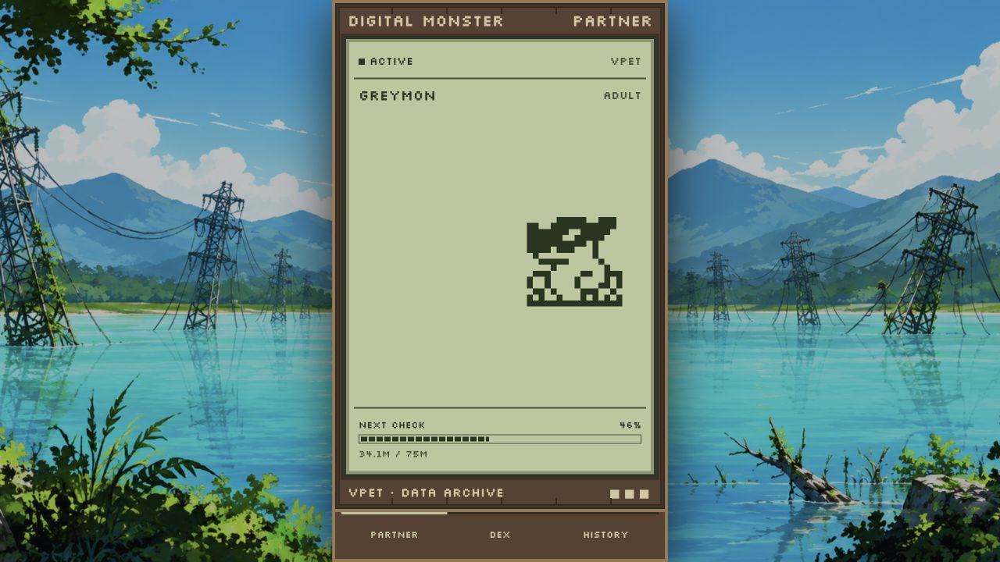
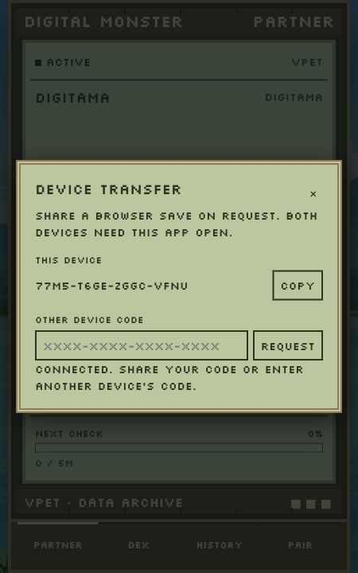

<div align="center" style="text-align: center;">
<center>
  <p align="center" style="text-align: center;">
    
  </p>
  <h1 align="center" style="text-align: center;">Web Digital Pet</h1>
  <p align="center" style="text-align: center;">
    <strong>Digimon companion in the browser — shared SQLite archive with Cursor and OpenCode, or a standalone browser save with PWA install and device transfer</strong>
  </p>
  <p align="center" style="text-align: center;">
    <a href="../../LICENSE"></a>
    <a href="https://github.com/jcendal/digital-pet"></a>
  </p>
  <p align="center" style="text-align: center;">
    <a href="#-about">About</a> •
    <a href="#-features">Features</a> •
    <a href="#-quick-start">Quick start</a> •
    <a href="#-storage">Storage</a> •
    <a href="#-install-as-a-pwa">PWA</a> •
    <a href="#-transfer-a-browser-save">Transfer</a> •
    <a href="#%EF%B8%8F-configuration">Configuration</a> •
    <a href="#-privacy">Privacy</a> •
    <a href="#-authors">Authors</a>
  </p>
  <p align="center" style="text-align: center;">
    <a href="#-quick-start"></a>
    &nbsp;&nbsp;
    <a href="../cursor-digital-pet/README.md"></a>
    &nbsp;&nbsp;
    <a href="../opencode-digital-pet/README.md"></a>
  </p>
</center>
</div>

---

<div align="center" style="text-align: center;">
<center>
<p></p>
<p style="white-space: nowrap;">



</p>
</center>
</div>

<p align="center"><em>Screenshots above use an example SQLite archive. A new browser save starts with a Digitama.</em></p>

---

## 📖 About

**Web Digital Pet** is the browser companion in the [Digital Pet](https://github.com/jcendal/digital-pet) monorepo. It shows your animated partner, the Digidex, and generation history in a phone-width layout (up to 430 × 880 px), centered over an original Digital World background on larger screens. Bottom navigation keeps Partner, Dex, and History mounted so switching views does not reload the page.

When a shared `pet.db` is present on the host machine, the web app **reads** the same archive as
[@jcendal/cursor-digital-pet](https://open-vsx.org/extension/jcendal/cursor-digital-pet) and
[@jcendal/opencode-digital-pet](https://www.npmjs.com/package/@jcendal/opencode-digital-pet). When that file is absent, the app runs in **browser mode**: progress lives in IndexedDB, experience ticks on a five-minute schedule, and you can install the app as a PWA or move saves between devices with **PAIR**.

### 🎯 Key Highlights

- 🐣 **Two storage modes** — Shared local `pet.db` or an independent browser save
- 📱 **PWA-ready** — Manifest, icons, maskable assets, and a service worker for offline UI
- 🎮 **650 Digimon** — Same catalog, evolution art, and panels as the desktop integrations
- 📊 **Partner · Dex · History** — Shared webview UI from `digital-pet-webviews`
- 🔄 **Device transfer** — Request, preview, and import a browser save over WebRTC (browser mode)
- 🔒 **Privacy-first** — No accounts, no cloud backup; saves stay on your device or local disk
- 📖 **Read-only SQLite** — Cursor and OpenCode advance the shared archive; the web app does not write `pet.db`

---

## ✨ Features

| Feature | Description |
| --- | --- |
| **Partner view** | Animated Digimon with evolution progress toward the next stage |
| **Digidex** | Catalog browser with discoveries, filters (collapsed by default), and per-entry detail |
| **History** | Current and retired generations with recorded evolution journeys |
| **SQLite mode** | Live view of the shared `pet.db` while Cursor or OpenCode records usage |
| **Browser mode** | Digitama hatch, timed experience, automatic evolution, IndexedDB persistence |
| **PWA install** | Add to home screen or desktop with standalone window and cached shell |
| **PAIR transfer** | Approve incoming requests, preview remote saves, import with rollback backup |

---

## 🚀 Quick start

### Requirements

| Requirement | Details |
| --- | --- |
| **Node.js** | `24.11.0` or newer |
| **npm** | Workspace install from the monorepo root |
| **Bun** | `1.3.5` for package tests only |

From the repository root:

```sh
npm ci
npm run web
```

Open [http://localhost:4173](http://localhost:4173). The command builds this package and starts the local server on `127.0.0.1`. SQLite access uses Node's built-in SQLite support; a separate SQLite installation is not required.

> **Note:** A phone cannot reach your computer through its own `localhost`. Access from another device needs HTTPS via a tunnel or proxy you control. This server is for local development, not public hosting.

### Try browser mode locally

Point the server at a database path that does not exist:

```sh
DIGITAL_PET_DATABASE_PATH=/path/to/nonexistent/pet.db npm run web
```

---

## 💾 Storage

The app picks its mode from whether the configured `pet.db` file exists on the host.

| | Local SQLite archive | Browser save |
| --- | --- | --- |
| **When** | Configured `pet.db` exists | Configured `pet.db` does not exist |
| **Partner** | Shared with Cursor and OpenCode on that computer | Separate partner, starting with a Digitama |
| **Experience** | Token usage from the integrations | One twenty-fourth of the stage threshold per completed five-minute interval |
| **Persistence** | Existing database (read-only from the web app) | IndexedDB for this browser origin |
| **Offline** | Live progress needs the local server | UI and save after the service worker cache |
| **PAIR** | Unavailable | On request between open browser sessions |

Default `pet.db` location (same as the other apps):

| Platform | Default path |
| --- | --- |
| **macOS** | `~/Library/Application Support/opencode-digital-pet/pet.db` |
| **Linux / WSL** | `~/.local/share/opencode-digital-pet/pet.db` |
| **Windows** | `%APPDATA%\opencode-digital-pet\pet.db` |

Override with `DIGITAL_PET_DATABASE_PATH`. In SQLite mode, partner progression and history are updated only by Cursor or OpenCode.

In browser mode, elapsed five-minute intervals are applied when you reopen the app; evolution is automatic. The save includes partner progress, discoveries, history, and a stable device code. It is tied to this site's origin — another browser, host, or port has separate storage. Clearing site data removes the save and its local backup.

---

## 📱 Install as a PWA

1. Open the app and wait for the first load to finish.
2. Use the browser **Install app** or **Add to Home Screen** action when offered.
3. Launch Digital Pet from the installed icon.

The package ships a web app manifest, favicons, standard and maskable icons, and a service worker that caches the shell for offline use. A browser save can keep progressing offline; **PAIR** needs a network connection, and SQLite mode needs the local server. Installation away from `localhost` requires HTTPS.

---

## 🔗 Transfer a browser save

Keep the app **open and online** on both devices. **PAIR** appears only in browser mode.

<div align="center">
  
</div>

1. On device **B**, open **PAIR** and copy its device code.
2. On device **A**, open **PAIR**, enter B's code, and select **REQUEST**.
3. On **B**, choose **SEND SAVE** to approve or **DECLINE** to cancel.
4. On **A**, review the preview. Choose **REPLACE SAVE** to import or **KEEP MINE** to keep the current save.
5. After importing, **A** can use **RESTORE PREVIOUS SAVE** to recover the backed-up copy.

This is a one-time transfer: **B** keeps its save, **A** keeps its device code, and progress diverges afterward. Switching Partner, Dex, or History does not cancel an active request.

[PeerJS Cloud](https://peerjs.com/server/cloud) provides free signaling; WebRTC carries the save peer-to-peer. The public service has no TURN relay, so some networks may block the connection. Incoming requests appear only while the app is open — there are no background push notifications.

---

## ⚙️ Configuration

| Setting | Default | Description |
| --- | --- | --- |
| `PORT` | `4173` | Local web server port (`1`–`65535`) |
| `DIGITAL_PET_DATABASE_PATH` | Shared Digital Pet app-data `pet.db` | SQLite file to read; a missing file enables browser mode |

Example — custom archive and port:

```sh
DIGITAL_PET_DATABASE_PATH=/path/to/pet.db PORT=4174 npm run web
```

### Development commands

Run from the repository root. Tests require Bun.

```sh
npm run build --workspace @jcendal/web-digital-pet
npm run check --workspace @jcendal/web-digital-pet
npm run test --workspace @jcendal/web-digital-pet
```

This package adds the local server, SQLite read adapter, IndexedDB save, timed browser progression, and device transfer. Rendering and panels come from `digital-pet-core`, `digital-pet-webviews`, and `digital-pet-animation`. See the [Cursor extension](../cursor-digital-pet/README.md) and [OpenCode plugin](../opencode-digital-pet/README.md) guides for desktop setup.

---

## 🔒 Privacy

- ✅ No analytics or telemetry in the web package
- ✅ SQLite mode keeps partner data in your local `pet.db` only
- ✅ Browser saves stay in IndexedDB on your device; no account or cloud sync
- ⚠️ **PAIR** uses PeerJS Cloud for signaling and exchanges save data directly between browsers you approve
- ⚠️ Clearing site data or uninstalling the PWA removes browser saves unless you transferred them elsewhere

---

## 🤝 Contributing

Contributions and issues belong in the [monorepo](https://github.com/jcendal/digital-pet).

Package path: [`packages/web-digital-pet`](https://github.com/jcendal/digital-pet/tree/main/packages/web-digital-pet)

---

## 👤 Authors

| Role | Name |
| --- | --- |
| **Maintainer** | [Jorge Cendal](https://github.com/jcendal) |
| **Original author and contributor** | [Sergio Bugallo](https://github.com/sbugallo) |

---

## 📜 License

[Apache-2.0](../../LICENSE)

Part of the [Digital Pet](https://github.com/jcendal/digital-pet) monorepo. Digimon sprites were derived from community sources — see the [root README credits](https://github.com/jcendal/digital-pet#maintainer-and-credits).

---

<p align="center"><strong>Built with ❤️ for the developer community</strong></p>

<p align="center"><a href="#web-digital-pet">⬆ Back to Top</a></p>
