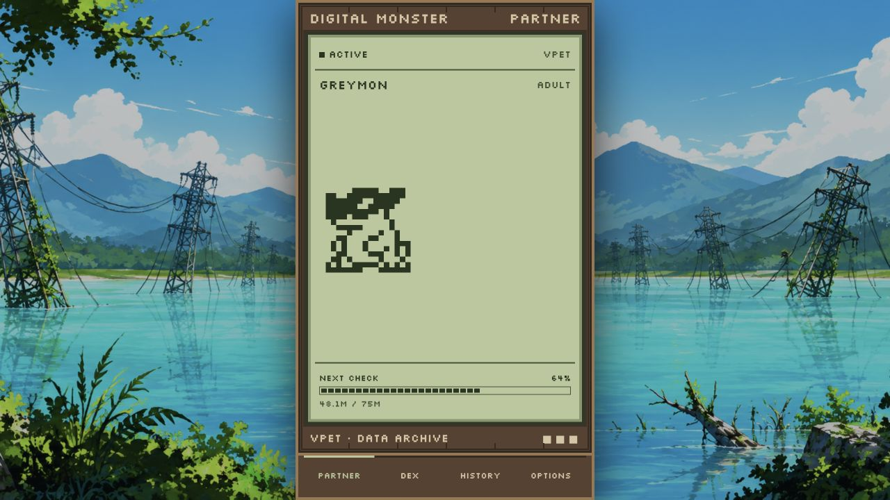
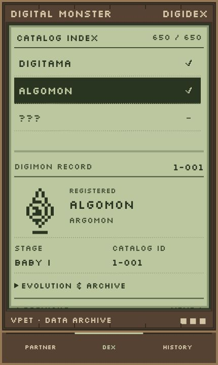
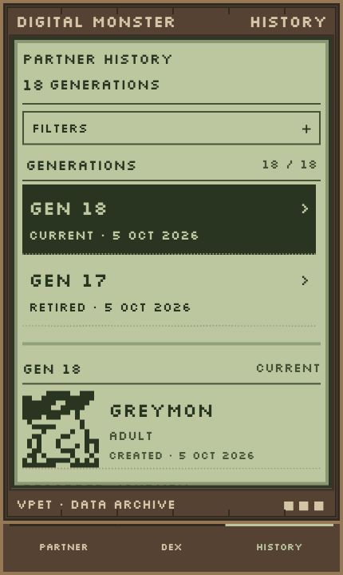
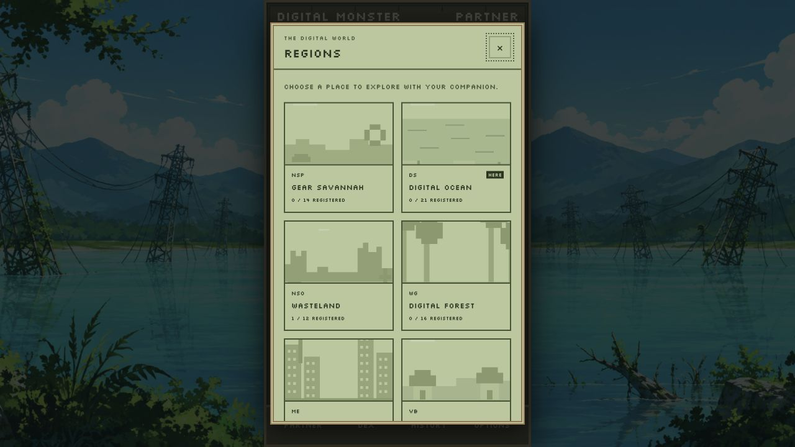
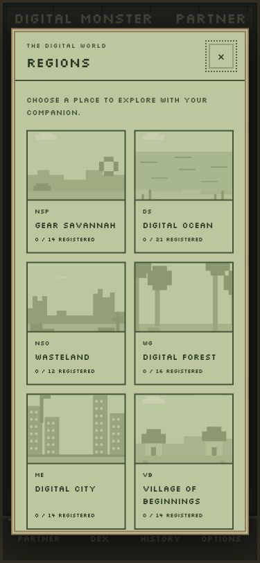
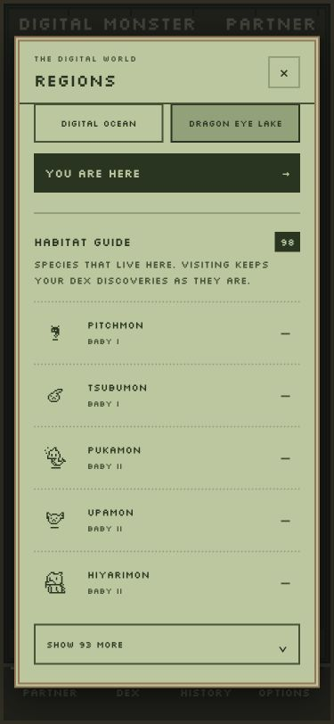
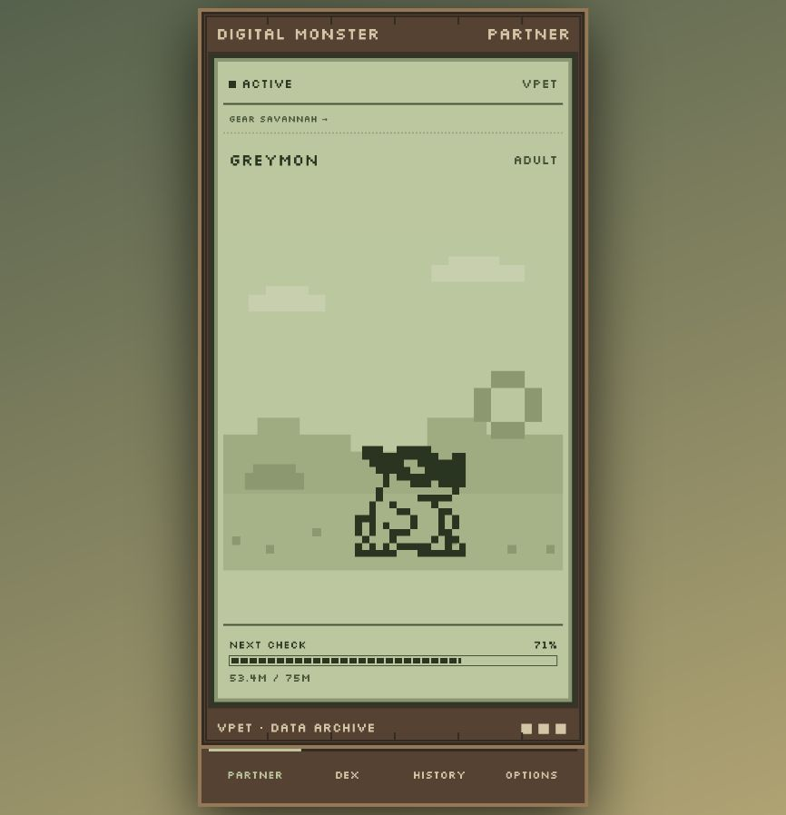
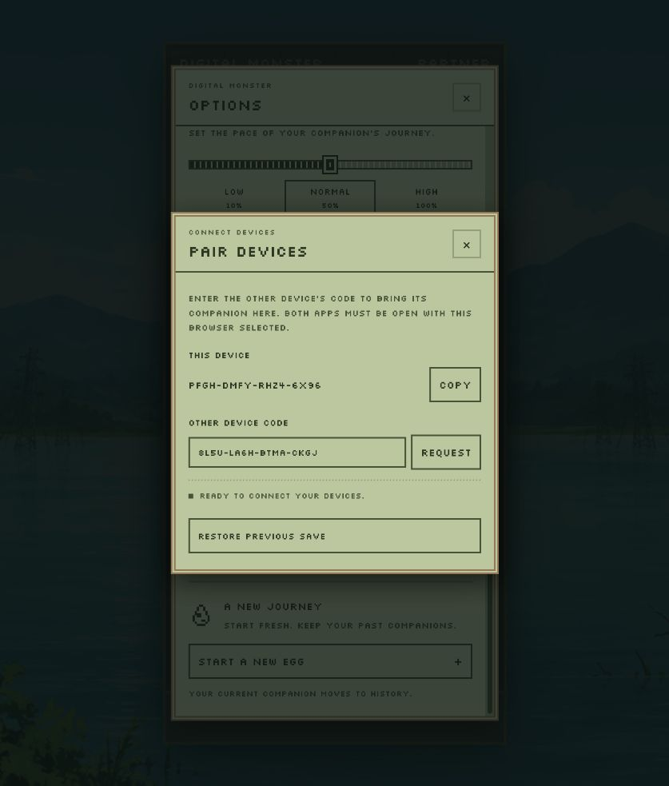
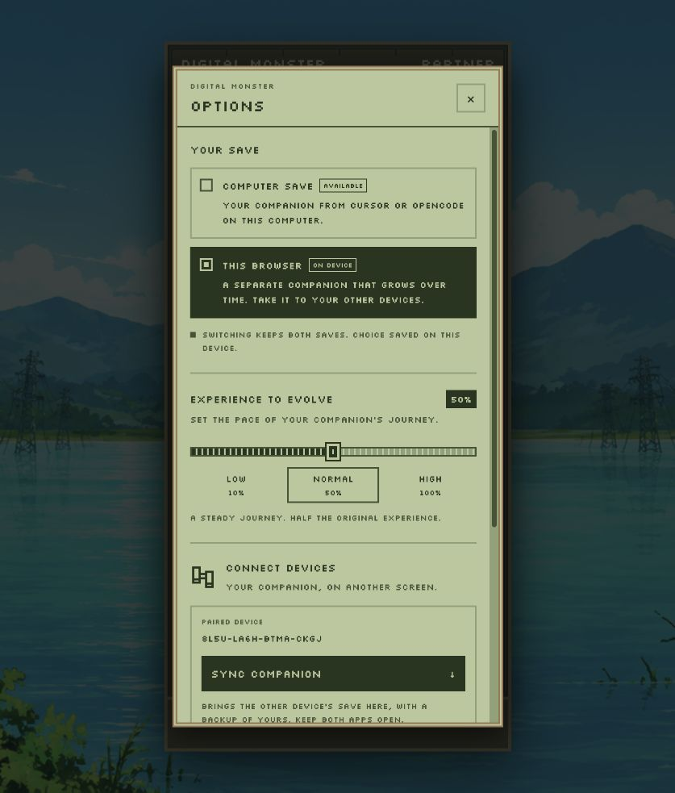
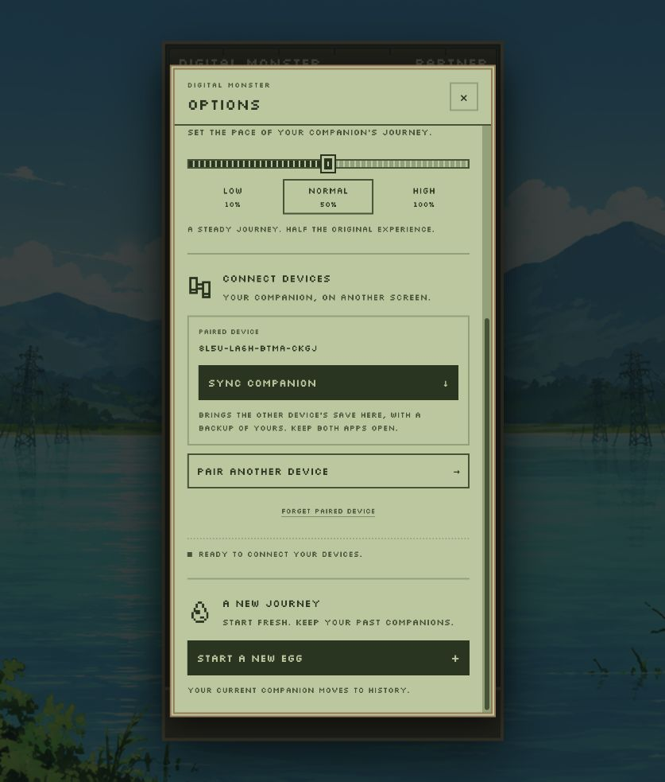

<div align="center" style="text-align: center;">
<center>
  <p align="center" style="text-align: center;">
    
  </p>
  <h1 align="center" style="text-align: center;">Web Digital Pet</h1>
  <p align="center" style="text-align: center;">
    <strong>Digimon companion in the browser — shared SQLite archive with Cursor and OpenCode, or a standalone browser save with PWA install and device transfer</strong>
  </p>
  <p align="center" style="text-align: center;">
    <a href="../../LICENSE"></a>
    <a href="https://github.com/jcendal/digital-pet"></a>
  </p>
  <p align="center" style="text-align: center;">
    <a href="#-about">About</a> •
    <a href="#-features">Features</a> •
    <a href="#-quick-start">Quick start</a> •
    <a href="#-storage">Storage</a> •
    <a href="#-install-as-a-pwa">PWA</a> •
    <a href="#-transfer-a-browser-save">Transfer</a> •
    <a href="#%EF%B8%8F-configuration">Configuration</a> •
    <a href="#-privacy">Privacy</a> •
    <a href="#-authors">Authors</a>
  </p>
  <p align="center" style="text-align: center;">
    <a href="#-quick-start"></a>
    &nbsp;&nbsp;
    <a href="../cursor-digital-pet/README.md"></a>
    &nbsp;&nbsp;
    <a href="../opencode-digital-pet/README.md"></a>
  </p>
</center>
</div>

---

<div align="center" style="text-align: center;">
<center>
<p></p>
<p style="white-space: nowrap;">


</p>
</center>
</div>

<p align="center"><em>Partner, Digidex, and History above use an example computer save. A new browser save starts with a Digitama.</em></p>

---

## 📖 About

**Web Digital Pet** is the browser companion in the [Digital Pet](https://github.com/jcendal/digital-pet) monorepo. It shows your animated partner, the Digidex, and generation history in a phone-width layout (up to 430 × 880 px), centered over an original Digital World background on larger screens. Bottom navigation keeps Partner, Dex, and History mounted so switching views does not reload the page.

When a shared `pet.db` is present on the host machine, the web app **reads** the same archive as
[@jcendal/cursor-digital-pet](https://open-vsx.org/extension/jcendal/cursor-digital-pet) and
[@jcendal/opencode-digital-pet](https://www.npmjs.com/package/@jcendal/opencode-digital-pet). When that file is absent, the app runs in **browser mode**: progress lives in IndexedDB, experience grows by 2% of the selected level requirement every two hours, and you can install the app as a PWA or move saves between devices from **OPTIONS → PAIR DEVICES**. You can also choose a browser companion even when a computer save is available.

### 🎯 Key Highlights

- 🐣 **Two storage modes** — Shared local `pet.db` or an independent browser save
- 📱 **PWA-ready** — Manifest, icons, maskable assets, and a service worker for offline UI
- 🎮 **650 Digimon** — Same catalog, evolution art, and panels as the desktop integrations
- 📊 **Partner · Dex · History** — Shared webview UI from `digital-pet-webviews`
- ⚙️ **Options panel** — Choose your save, set evolution experience, and start a new egg
- 🌐 **Four interface languages** — English, Korean, Spanish and Galician. The first visit uses a supported browser language; **Options → Language** saves an explicit choice on this device. Language changes work offline and preserve your companion.
- 🌍 **Explore regions** — Ten destinations, a habitat guide, and eleven LCD landscapes
- 🔄 **Manual device sync** — Pair once, then bring the other browser's save with **SYNC**
- 🔒 **Privacy-first** — No accounts, no cloud backup; saves stay on your device or local disk
- 📖 **Read-only SQLite** — Cursor and OpenCode advance the shared archive; the web app does not write `pet.db`

---

## ✨ Features

| Feature | Description |
| --- | --- |
| **Partner view** | Animated Digimon with evolution progress toward the next stage |
| **Digidex** | Catalog browser with discoveries, filters (collapsed by default), and per-entry detail |
| **Regions** | Explore ten classic Field destinations, visit Dragon Eye Lake, and change your companion’s LCD landscape |
| **History** | Current and retired generations with recorded evolution journeys |
| **SQLite mode** | Live view of the shared `pet.db` while Cursor or OpenCode records usage |
| **Browser mode** | Digitama hatch, timed experience, visible battles and evolution, IndexedDB persistence |
| **Visible evolution** | Experience stops at 100% until Partner is visible and the app has focus. Battles and transformations pause when you leave; waiting time does not accumulate extra growth |
| **PWA install** | Add to home screen or desktop with standalone window and cached shell |
| **Options** | Fourth navigation button opens the save selector, growth settings, new egg, and device pairing |
| **Evolution experience** | Low = 10% of the original requirement, Normal = 50%, High = 100% |
| **New egg** | Start a fresh browser companion while keeping the previous generation in History |
| **Pet egg** | Click or tap the egg for 1% of its hatching requirement and pixel stars. Rewards persist offline and stop when hatching begins; keyboard activation is supported |
| **Food** | One pixel apple appears after one hour. Click to eat and gain 10% of the current evolution requirement. Eggs have no food; eating and evolution restart the timer |
| **Hygiene** | Piles appear 2 hours after hatching, then 8 and 16 hours later (maximum three). Click each pile for 5% of the selected stage requirement. Two or more piles make the companion sad; cleaning makes it happy for three seconds |
| **Player battles** | BATTLE in the bottom navigation. Share a live six-digit code, challenge and accept. Acceptance closes the panel and shows both fighters, score and outcome in the pet viewer. The winner earns 20% of their selected level requirement |
| **Shared combat rules** | Strength and evasion from 0–100 determine each hit. Three hits win; a timeout draws. Only a victory evolves along the current Digimon's catalogue branches |
| **Device pairing and Sync** | Approve the first exchange, remember the device, then request later transfers with one button and a rollback backup |

Hygiene timers and piles belong to the companion, survive reloads and transfers, and continue while closed. Cleaning restarts the next timer according to the remaining number of piles (2/8/16 hours); a new egg starts fresh. Final stages can be cleaned without adding unused XP.

Food belongs to your browser companion and survives closing the app or transferring its save.
At a final stage, eating plays the animation without adding unused experience. Final-stage companions can also battle, without gaining unused experience. Existing four-hour food schedules are shortened to at most one hour on the next visit.
The [gameplay architecture review](../../docs/gameplay-architecture.md) documents layer ownership,
evolution coverage, the combat formula and research sources.

---

## 🚀 Quick start

### Requirements

| Requirement | Details |
| --- | --- |
| **Node.js** | `24.11.0` or newer |
| **npm** | Workspace install from the monorepo root |
| **Bun** | `1.3.5` for package tests only |

From the repository root:

```sh
npm ci
npm run web
```

Open [http://localhost:4173](http://localhost:4173). The command builds this package and starts the local server on `127.0.0.1`. SQLite access uses Node's built-in SQLite support; a separate SQLite installation is not required.

> **Note:** A phone cannot reach your computer through its own `localhost`. Access from another device needs HTTPS via a tunnel or proxy you control. This server is for local development, not public hosting.

### Try browser mode locally

Open **OPTIONS** and select **THIS BROWSER**. This keeps the computer save and browser save separate. To test a host without any computer save, point the server at a database path that does not exist:

```sh
DIGITAL_PET_DATABASE_PATH=/path/to/nonexistent/pet.db npm run web
```

---

## 🌍 Explore the Digital World

Open **OPTIONS → YOUR WORLD → EXPLORE REGIONS**, or select the place name above your partner's viewer. Browse ten destinations, inspect their inhabitants, and choose **TRAVEL HERE**. Digital Ocean also includes **Dragon Eye Lake**, the starting location with the existing background illustration.

Each place has its own LCD pixel landscape. While your companion walks, the landscape drifts slowly in the same direction; it pauses during other actions. Reflected copies keep the edges continuous. **OPTIONS → YOUR WORLD → MOVING LANDSCAPE** turns the effect on or off for this device. It follows the device’s reduced motion preference until you choose a setting. The guide shows public species names and artwork, with a registration marker and Dex shortcut for species already in your save. Counts reflect your history; visiting does not register species or change evolution rules. All 650 catalog records have at least one habitat, combining reference Fields with explicit thematic choices where references are missing. Habitats can overlap between regions. The guide shows **five cards initially**; use the arrow below them to reveal the remaining inhabitants. The arrow disappears when expanded. See the [habitat catalog notes](../digital-pet-fields/README.md) for sources and classification details.

<div align="center">
  
  
  
  
</div>

Travel is available for both saves. The browser destination travels with its save during Pair / Sync and remains when starting a new egg. The computer destination is a separate web preference, without changing SQLite. The four future Fields are documented but inactive.

---

## 💾 Storage

Open **OPTIONS → YOUR SAVE** to choose **COMPUTER SAVE** (the companion raised with Cursor or OpenCode) or **THIS BROWSER** (an independent companion saved in this browser). The default is the computer save when available, otherwise the browser save. Switching remembers your choice and preserves both saves; it does not copy or merge them.

| | Local SQLite archive | Browser save |
| --- | --- | --- |
| **When** | Choose COMPUTER SAVE while the configured `pet.db` exists | Choose THIS BROWSER, or no computer save is available |
| **Partner** | Shared with Cursor and OpenCode on that computer | Separate partner, starting with a Digitama |
| **Experience** | Token usage from the integrations | 2% of the selected stage requirement per completed two-hour interval |
| **Persistence** | Existing database (read-only from the web app) | IndexedDB for this browser origin |
| **Offline** | Live progress needs the local server | UI and save after the service worker cache |
| **Growth / new egg** | Managed in Cursor or OpenCode | Configurable in OPTIONS; retired companions stay in History |
| **Pair / Sync** | Unavailable | On request between paired, open browser sessions |

Default `pet.db` location (same as the other apps):

| Platform | Default path |
| --- | --- |
| **macOS** | `~/Library/Application Support/opencode-digital-pet/pet.db` |
| **Linux / WSL** | `~/.local/share/opencode-digital-pet/pet.db` |
| **Windows** | `%APPDATA%\opencode-digital-pet\pet.db` |

Override with `DIGITAL_PET_DATABASE_PATH`. In SQLite mode, partner progression and history are updated only by Cursor or OpenCode.

In browser mode, elapsed two-hour intervals are applied when you reopen the app; evolution is automatic. The save includes partner progress, discoveries, history, and the selected evolution experience and location. The stable device code and paired device are stored separately, so importing a save keeps this device's identity. It is tied to this site's origin — another browser, host, or port has separate storage. Clearing site data removes the save and its local backup.

---

## 📱 Install as a PWA

The public browser-only version can be built with `npm run build:static --workspace @jcendal/web-digital-pet` from the repository root. It writes `dist-static` without starting the local server or including `pet.db`. See the [AWS deployment guide](../../docs/web-deployment.md) for the one-time subdomain setup and automatic GitHub deployment.

1. Open the app and wait for the first load to finish.
2. Use the browser **Install app** or **Add to Home Screen** action when offered.
3. Launch Digital Pet from the installed icon.

The package ships a web app manifest, favicons, standard and maskable icons, and a service worker that caches the shell for offline use. A browser save can keep progressing offline; **Pair / Sync** and **Player Battle** need a network connection, and SQLite mode needs the local server. Installation away from `localhost` requires HTTPS.

---

## 🔗 Transfer a browser save

Keep the app **open and online** on both devices, with **OPTIONS → THIS BROWSER** selected. Computer saves are not transferred.

<div align="center">
  
</div>

1. On device **B**, open **OPTIONS → PAIR DEVICES** and copy its device code.
2. On device **A**, open **OPTIONS → PAIR DEVICES**, enter B's code, and select **REQUEST**.
3. On **B**, choose **SEND SAVE & PAIR** to approve or **DECLINE** to cancel.
4. On **A**, review the preview. Choose **REPLACE SAVE & PAIR** to import or **KEEP MINE** to keep the current save.
5. After importing, **A** can use **RESTORE PREVIOUS SAVE** to recover the backed-up copy.

After the first accepted transfer, both devices remember each other. In **OPTIONS → CONNECT DEVICES**, press **SYNC** on A to request B's current save again, without entering its code or repeating approval. B must remain open with **THIS BROWSER** selected. **FORGET DEVICE** removes the remembered pairing on that device.

Each transfer replaces the receiving device's browser save and keeps a backup. **B** keeps its save, **A** keeps its device code, and progress can diverge afterward. **SYNC always brings the other device's save here**; it does not merge progress, pick the newest save, or run continuously. Switching Partner, Dex, or History does not cancel an active request.

[PeerJS Cloud](https://peerjs.com/server/cloud) provides free signaling; WebRTC carries the save peer-to-peer. The public service has no TURN relay, so some networks may block the connection. Incoming requests appear only while the app is open — there are no background push notifications.

---

## Player battles

Choose **BATTLE** in the bottom navigation on two browsers with **THIS BROWSER** selected.
Share the six-digit battle code, enter it on the other browser and choose
**CHALLENGE**. The receiving player must choose **ACCEPT BATTLE**. Eggs and companions
with an evolution pending cannot enter a player battle. Codes belong to the live
page and change on reload; collisions are retried by registering a different code.
They are separate from the persistent 16-character codes used for save transfers.

Accepting closes the request panel. Both players are taken to the companion viewer,
where the shared pixel animation shows their Digimon, the opponent, hit scores and
the final outcome. The panel is only used for codes and invitations.

Both clients use the actual selected Digimon's catalogue combat stats, commit and
reveal independently generated randomness, calculate the same battle plan and
compare its SHA-256 digest before playback. The challenger is the canonical first
participant, so the same winner is shown from each player's perspective. The
winner receives 20% of their own selected level requirement, capped at the evolution
threshold. There is no loss penalty and a draw awards no experience. The prize and
a local battle receipt, seed, fighters and complete plan are saved atomically before animation, preventing duplicate
awards on the same browser even after reloading or restoring a backup.

Both apps must remain connected through agreement. A declined, expired or
interrupted negotiation gives no reward. Once a result is agreed, leaving the
companion viewer or opening another panel pauses playback. Returning to the viewer
continues it; reloading resumes from the last completed attack in the viewer, even
offline, without another XP award. A connection failure during final agreement
can leave only one client with a confirmed result; there is no durable shared
recovery service. See [the protocol and AWS assessment](docs/player-battles.md)
for the trust boundary and the proposed authoritative upgrade.

## ⚙️ Configuration

### In-app options

<div align="center">
  
  
</div>

**OPTIONS** opens a scrollable overlay from any section. Browser companion options are enabled when **THIS BROWSER** is selected:

| Evolution experience | Requirement | Effect |
| --- | --- | --- |
| **LOW** | 10% of HIGH | Faster evolution |
| **NORMAL** | 50% of HIGH | Half the original requirement |
| **HIGH** | 100% | Original progression (default) |

Each two-hour tick earns 2% of the selected requirement. Food gives 10% and a player battle win gives 20% of that requirement. Changes apply to future evolution checks and travel with transferred saves. **START A NEW EGG** asks for confirmation, moves the current companion to History, and keeps the experience setting, location, and paired device.

### Server settings

| Setting | Default | Description |
| --- | --- | --- |
| `PORT` | `4173` | Local web server port (`1`–`65535`) |
| `DIGITAL_PET_DATABASE_PATH` | Shared Digital Pet app-data `pet.db` | SQLite file to read; a missing file enables browser mode |

Example — custom archive and port:

```sh
DIGITAL_PET_DATABASE_PATH=/path/to/pet.db PORT=4174 npm run web
```

### Development commands

Run from the repository root. Tests require Bun.

```sh
npm run build --workspace @jcendal/web-digital-pet
npm run check --workspace @jcendal/web-digital-pet
npm run test --workspace @jcendal/web-digital-pet
```

This package adds the local server, SQLite read adapter, IndexedDB save, timed browser progression, and device transfer. Rendering and panels come from `digital-pet-core`, `digital-pet-webviews`, and `digital-pet-animation`. World definitions and assets come from `digital-pet-fields`. See the [Cursor extension](../cursor-digital-pet/README.md) and [OpenCode plugin](../opencode-digital-pet/README.md) guides for desktop setup.

---

## 🔒 Privacy

- ✅ No analytics or telemetry in the web package
- ✅ SQLite mode keeps partner data in your local `pet.db` only
- ✅ Browser saves stay in IndexedDB on your device; no account or cloud sync
- ⚠️ **Pair / Sync** and **Player Battle** use PeerJS Cloud for signaling and exchange data directly between browsers you approve
- ⚠️ Clearing site data or uninstalling the PWA removes browser saves unless you transferred them elsewhere

---

## 🤝 Contributing

Contributions and issues belong in the [monorepo](https://github.com/jcendal/digital-pet).

Package path: [`packages/web-digital-pet`](https://github.com/jcendal/digital-pet/tree/main/packages/web-digital-pet)

---

## 👤 Authors

| Role | Name |
| --- | --- |
| **Maintainer** | [Jorge Cendal](https://github.com/jcendal) |
| **Original author and contributor** | [Sergio Bugallo](https://github.com/sbugallo) |

---

## 📜 License

[Apache-2.0](../../LICENSE)

Part of the [Digital Pet](https://github.com/jcendal/digital-pet) monorepo. Digimon sprites were derived from community sources — see the [root README credits](https://github.com/jcendal/digital-pet#maintainer-and-credits).

---

<p align="center"><strong>Built with ❤️ for the developer community</strong></p>

<p align="center"><a href="#web-digital-pet">⬆ Back to Top</a></p>
